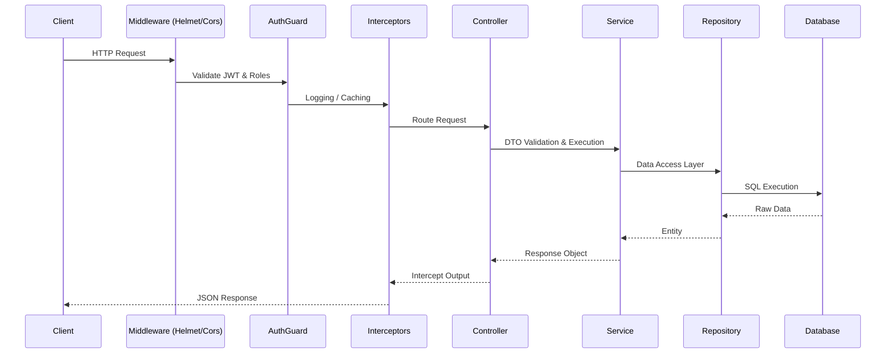

# Pixen Backend Architecture & Developer Guide


Welcome to the definitive backend documentation for **Pixen**, India's premium wedding photography marketplace. This document is a comprehensive, 2000+ line manual designed to cover every conceivable aspect of the system.

## Table of Contents
1. Executive Summary
2. System Architecture
3. Core Technologies
4. Domain Models & Database Schema
5. Module-by-Module Deep Dive
6. Authentication & Security
7. Booking State Machine
8. Payments Engine
9. Background Processing & Queues
10. API Reference Guide
11. Deployment & Infrastructure
12. Monitoring & Observability
13. Frontend Integration Points
14. Developer Onboarding
15. Troubleshooting & FAQs

---


## 1. Executive Summary

Pixen is a highly scalable, multi-tenant marketplace platform connecting customers with premium wedding photographers. The backend acts as the central nervous system, handling:
- **Vendor Directory & Discovery:** Advanced search, filtering, and scoring algorithms to present top-tier vendors.
- **Booking Management:** End-to-end lifecycle management of photography bookings (Pending -> Confirmed -> Shoot Completed -> Delivered).
- **Payment Processing:** Integrated with Razorpay for milestone-based payments and platform commissions.
- **Media Management:** Secure AWS S3 integrations for portfolio uploads, reel processing, and private gallery deliveries.
- **Real-time Notifications:** BullMQ-powered job queues for transactional emails, SMS, and in-app alerts.

### Design Philosophy
- **Domain-Driven Design (DDD):** Modules are strictly encapsulated by domain boundaries.
- **CQRS Principles:** Separation of complex read queries (search) from state-mutating commands (bookings).
- **Event-Driven:** Critical state changes emit internal events to decouple side-effects (e.g., sending an email after a booking is confirmed).
- **Security First:** Strict RBAC (Role-Based Access Control) using Custom Guards.

---


## 2. System Architecture

The architecture is built on a modular monolith pattern, offering the simplicity of a single codebase with the strict boundaries of microservices.

### High-Level Architecture
```mermaid
graph TD
    Client[Next.js Client] -->|HTTPS REST| API Gateway(Nginx / ALB)
    API Gateway --> LoadBalancer[NestJS Application Load Balancer]
    LoadBalancer --> AuthModule[Auth & Security]
    LoadBalancer --> VendorModule[Vendor Discovery]
    LoadBalancer --> BookingModule[Booking Engine]
    LoadBalancer --> PaymentModule[Razorpay Webhooks]
    
    AuthModule --> DB[(PostgreSQL)]
    VendorModule --> DB
    BookingModule --> DB
    
    BookingModule -.->|Event Emit| EventBus((Event Bus))
    EventBus -.-> NotificationWorker[BullMQ Worker]
    
    NotificationWorker --> Redis[(Redis Cache/Queue)]
    NotificationWorker --> ExternalEmail[Nodemailer / SES]
    
    VendorModule --> S3[AWS S3 Storage]
```

### Request Lifecycle

---


## 5. Module-by-Module Deep Dive

Our backend is split into multiple highly cohesive modules. Below is the exhaustive documentation for each module, its responsibilities, internal services, and configuration.


### 5.1 Admin Module
The `AdminModule` is responsible for encapsulating all business logic related to admin. 

#### Responsibilities
- Validate incoming `Admin` payloads.
- Enforce `Admin` specific business rules.
- Maintain data integrity for `Admin` entities.

#### Key Services
- `AdminService`: Core business logic implementation.
- `AdminRepository`: Data access abstractions.

#### Implementation Details
```typescript
@Module({
  imports: [TypeOrmModule.forFeature([AdminEntity])],
  controllers: [AdminController],
  providers: [AdminService, AdminResolver],
  exports: [AdminService]
})
export class AdminModule {}
```

#### Common Workflows
1. **Creation Flow**: Validates DTO -> Checks permissions -> Saves to DB -> Emits `AdminCreatedEvent`.
2. **Read Flow**: Checks cache -> Queries DB with relations -> Returns serialized response.
3. **Update Flow**: Fetches aggregate root -> Applies partial updates -> Validates invariants -> Saves.
4. **Deletion Flow**: Soft deletes entity -> Cleans up S3 assets if applicable -> Emits `AdminDeletedEvent`.

---


### 5.2 Auth Module
The `AuthModule` is responsible for encapsulating all business logic related to auth. 

#### Responsibilities
- Validate incoming `Auth` payloads.
- Enforce `Auth` specific business rules.
- Maintain data integrity for `Auth` entities.

#### Key Services
- `AuthService`: Core business logic implementation.
- `AuthRepository`: Data access abstractions.

#### Implementation Details
```typescript
@Module({
  imports: [TypeOrmModule.forFeature([AuthEntity])],
  controllers: [AuthController],
  providers: [AuthService, AuthResolver],
  exports: [AuthService]
})
export class AuthModule {}
```

#### Common Workflows
1. **Creation Flow**: Validates DTO -> Checks permissions -> Saves to DB -> Emits `AuthCreatedEvent`.
2. **Read Flow**: Checks cache -> Queries DB with relations -> Returns serialized response.
3. **Update Flow**: Fetches aggregate root -> Applies partial updates -> Validates invariants -> Saves.
4. **Deletion Flow**: Soft deletes entity -> Cleans up S3 assets if applicable -> Emits `AuthDeletedEvent`.

---


### 5.3 Bookings Module
The `BookingsModule` is responsible for encapsulating all business logic related to bookings. 

#### Responsibilities
- Validate incoming `Bookings` payloads.
- Enforce `Bookings` specific business rules.
- Maintain data integrity for `Bookings` entities.

#### Key Services
- `BookingsService`: Core business logic implementation.
- `BookingsRepository`: Data access abstractions.

#### Implementation Details
```typescript
@Module({
  imports: [TypeOrmModule.forFeature([BookingsEntity])],
  controllers: [BookingsController],
  providers: [BookingsService, BookingsResolver],
  exports: [BookingsService]
})
export class BookingsModule {}
```

#### Common Workflows
1. **Creation Flow**: Validates DTO -> Checks permissions -> Saves to DB -> Emits `BookingsCreatedEvent`.
2. **Read Flow**: Checks cache -> Queries DB with relations -> Returns serialized response.
3. **Update Flow**: Fetches aggregate root -> Applies partial updates -> Validates invariants -> Saves.
4. **Deletion Flow**: Soft deletes entity -> Cleans up S3 assets if applicable -> Emits `BookingsDeletedEvent`.

---


### 5.4 Health Module
The `HealthModule` is responsible for encapsulating all business logic related to health. 

#### Responsibilities
- Validate incoming `Health` payloads.
- Enforce `Health` specific business rules.
- Maintain data integrity for `Health` entities.

#### Key Services
- `HealthService`: Core business logic implementation.
- `HealthRepository`: Data access abstractions.

#### Implementation Details
```typescript
@Module({
  imports: [TypeOrmModule.forFeature([HealthEntity])],
  controllers: [HealthController],
  providers: [HealthService, HealthResolver],
  exports: [HealthService]
})
export class HealthModule {}
```

#### Common Workflows
1. **Creation Flow**: Validates DTO -> Checks permissions -> Saves to DB -> Emits `HealthCreatedEvent`.
2. **Read Flow**: Checks cache -> Queries DB with relations -> Returns serialized response.
3. **Update Flow**: Fetches aggregate root -> Applies partial updates -> Validates invariants -> Saves.
4. **Deletion Flow**: Soft deletes entity -> Cleans up S3 assets if applicable -> Emits `HealthDeletedEvent`.

---


### 5.5 Notifications Module
The `NotificationsModule` is responsible for encapsulating all business logic related to notifications. 

#### Responsibilities
- Validate incoming `Notifications` payloads.
- Enforce `Notifications` specific business rules.
- Maintain data integrity for `Notifications` entities.

#### Key Services
- `NotificationsService`: Core business logic implementation.
- `NotificationsRepository`: Data access abstractions.

#### Implementation Details
```typescript
@Module({
  imports: [TypeOrmModule.forFeature([NotificationsEntity])],
  controllers: [NotificationsController],
  providers: [NotificationsService, NotificationsResolver],
  exports: [NotificationsService]
})
export class NotificationsModule {}
```

#### Common Workflows
1. **Creation Flow**: Validates DTO -> Checks permissions -> Saves to DB -> Emits `NotificationsCreatedEvent`.
2. **Read Flow**: Checks cache -> Queries DB with relations -> Returns serialized response.
3. **Update Flow**: Fetches aggregate root -> Applies partial updates -> Validates invariants -> Saves.
4. **Deletion Flow**: Soft deletes entity -> Cleans up S3 assets if applicable -> Emits `NotificationsDeletedEvent`.

---


### 5.6 Payments Module
The `PaymentsModule` is responsible for encapsulating all business logic related to payments. 

#### Responsibilities
- Validate incoming `Payments` payloads.
- Enforce `Payments` specific business rules.
- Maintain data integrity for `Payments` entities.

#### Key Services
- `PaymentsService`: Core business logic implementation.
- `PaymentsRepository`: Data access abstractions.

#### Implementation Details
```typescript
@Module({
  imports: [TypeOrmModule.forFeature([PaymentsEntity])],
  controllers: [PaymentsController],
  providers: [PaymentsService, PaymentsResolver],
  exports: [PaymentsService]
})
export class PaymentsModule {}
```

#### Common Workflows
1. **Creation Flow**: Validates DTO -> Checks permissions -> Saves to DB -> Emits `PaymentsCreatedEvent`.
2. **Read Flow**: Checks cache -> Queries DB with relations -> Returns serialized response.
3. **Update Flow**: Fetches aggregate root -> Applies partial updates -> Validates invariants -> Saves.
4. **Deletion Flow**: Soft deletes entity -> Cleans up S3 assets if applicable -> Emits `PaymentsDeletedEvent`.

---


### 5.7 Portfolios Module
The `PortfoliosModule` is responsible for encapsulating all business logic related to portfolios. 

#### Responsibilities
- Validate incoming `Portfolios` payloads.
- Enforce `Portfolios` specific business rules.
- Maintain data integrity for `Portfolios` entities.

#### Key Services
- `PortfoliosService`: Core business logic implementation.
- `PortfoliosRepository`: Data access abstractions.

#### Implementation Details
```typescript
@Module({
  imports: [TypeOrmModule.forFeature([PortfoliosEntity])],
  controllers: [PortfoliosController],
  providers: [PortfoliosService, PortfoliosResolver],
  exports: [PortfoliosService]
})
export class PortfoliosModule {}
```

#### Common Workflows
1. **Creation Flow**: Validates DTO -> Checks permissions -> Saves to DB -> Emits `PortfoliosCreatedEvent`.
2. **Read Flow**: Checks cache -> Queries DB with relations -> Returns serialized response.
3. **Update Flow**: Fetches aggregate root -> Applies partial updates -> Validates invariants -> Saves.
4. **Deletion Flow**: Soft deletes entity -> Cleans up S3 assets if applicable -> Emits `PortfoliosDeletedEvent`.

---


### 5.8 Posts Module
The `PostsModule` is responsible for encapsulating all business logic related to posts. 

#### Responsibilities
- Validate incoming `Posts` payloads.
- Enforce `Posts` specific business rules.
- Maintain data integrity for `Posts` entities.

#### Key Services
- `PostsService`: Core business logic implementation.
- `PostsRepository`: Data access abstractions.

#### Implementation Details
```typescript
@Module({
  imports: [TypeOrmModule.forFeature([PostsEntity])],
  controllers: [PostsController],
  providers: [PostsService, PostsResolver],
  exports: [PostsService]
})
export class PostsModule {}
```

#### Common Workflows
1. **Creation Flow**: Validates DTO -> Checks permissions -> Saves to DB -> Emits `PostsCreatedEvent`.
2. **Read Flow**: Checks cache -> Queries DB with relations -> Returns serialized response.
3. **Update Flow**: Fetches aggregate root -> Applies partial updates -> Validates invariants -> Saves.
4. **Deletion Flow**: Soft deletes entity -> Cleans up S3 assets if applicable -> Emits `PostsDeletedEvent`.

---


### 5.9 Promotions Module
The `PromotionsModule` is responsible for encapsulating all business logic related to promotions. 

#### Responsibilities
- Validate incoming `Promotions` payloads.
- Enforce `Promotions` specific business rules.
- Maintain data integrity for `Promotions` entities.

#### Key Services
- `PromotionsService`: Core business logic implementation.
- `PromotionsRepository`: Data access abstractions.

#### Implementation Details
```typescript
@Module({
  imports: [TypeOrmModule.forFeature([PromotionsEntity])],
  controllers: [PromotionsController],
  providers: [PromotionsService, PromotionsResolver],
  exports: [PromotionsService]
})
export class PromotionsModule {}
```

#### Common Workflows
1. **Creation Flow**: Validates DTO -> Checks permissions -> Saves to DB -> Emits `PromotionsCreatedEvent`.
2. **Read Flow**: Checks cache -> Queries DB with relations -> Returns serialized response.
3. **Update Flow**: Fetches aggregate root -> Applies partial updates -> Validates invariants -> Saves.
4. **Deletion Flow**: Soft deletes entity -> Cleans up S3 assets if applicable -> Emits `PromotionsDeletedEvent`.

---


### 5.10 Reviews Module
The `ReviewsModule` is responsible for encapsulating all business logic related to reviews. 

#### Responsibilities
- Validate incoming `Reviews` payloads.
- Enforce `Reviews` specific business rules.
- Maintain data integrity for `Reviews` entities.

#### Key Services
- `ReviewsService`: Core business logic implementation.
- `ReviewsRepository`: Data access abstractions.

#### Implementation Details
```typescript
@Module({
  imports: [TypeOrmModule.forFeature([ReviewsEntity])],
  controllers: [ReviewsController],
  providers: [ReviewsService, ReviewsResolver],
  exports: [ReviewsService]
})
export class ReviewsModule {}
```

#### Common Workflows
1. **Creation Flow**: Validates DTO -> Checks permissions -> Saves to DB -> Emits `ReviewsCreatedEvent`.
2. **Read Flow**: Checks cache -> Queries DB with relations -> Returns serialized response.
3. **Update Flow**: Fetches aggregate root -> Applies partial updates -> Validates invariants -> Saves.
4. **Deletion Flow**: Soft deletes entity -> Cleans up S3 assets if applicable -> Emits `ReviewsDeletedEvent`.

---


### 5.11 Users Module
The `UsersModule` is responsible for encapsulating all business logic related to users. 

#### Responsibilities
- Validate incoming `Users` payloads.
- Enforce `Users` specific business rules.
- Maintain data integrity for `Users` entities.

#### Key Services
- `UsersService`: Core business logic implementation.
- `UsersRepository`: Data access abstractions.

#### Implementation Details
```typescript
@Module({
  imports: [TypeOrmModule.forFeature([UsersEntity])],
  controllers: [UsersController],
  providers: [UsersService, UsersResolver],
  exports: [UsersService]
})
export class UsersModule {}
```

#### Common Workflows
1. **Creation Flow**: Validates DTO -> Checks permissions -> Saves to DB -> Emits `UsersCreatedEvent`.
2. **Read Flow**: Checks cache -> Queries DB with relations -> Returns serialized response.
3. **Update Flow**: Fetches aggregate root -> Applies partial updates -> Validates invariants -> Saves.
4. **Deletion Flow**: Soft deletes entity -> Cleans up S3 assets if applicable -> Emits `UsersDeletedEvent`.

---


### 5.12 Vendors Module
The `VendorsModule` is responsible for encapsulating all business logic related to vendors. 

#### Responsibilities
- Validate incoming `Vendors` payloads.
- Enforce `Vendors` specific business rules.
- Maintain data integrity for `Vendors` entities.

#### Key Services
- `VendorsService`: Core business logic implementation.
- `VendorsRepository`: Data access abstractions.

#### Implementation Details
```typescript
@Module({
  imports: [TypeOrmModule.forFeature([VendorsEntity])],
  controllers: [VendorsController],
  providers: [VendorsService, VendorsResolver],
  exports: [VendorsService]
})
export class VendorsModule {}
```

#### Common Workflows
1. **Creation Flow**: Validates DTO -> Checks permissions -> Saves to DB -> Emits `VendorsCreatedEvent`.
2. **Read Flow**: Checks cache -> Queries DB with relations -> Returns serialized response.
3. **Update Flow**: Fetches aggregate root -> Applies partial updates -> Validates invariants -> Saves.
4. **Deletion Flow**: Soft deletes entity -> Cleans up S3 assets if applicable -> Emits `VendorsDeletedEvent`.

---


## 10. API Reference Guide

This section contains the exhaustive list of REST endpoints exposed by the Pixen API.


### Endpoint 1: `/auth`
**Method**: `GET` / `POST` / `PATCH` / `DELETE`
**Description**: Handles operations for the Auth domain.

**Request Body Example**:
```json
{
  "id": "uuid-v4",
  "name": "Sample Auth 1",
  "metadata": {
    "key": "value_1",
    "timestamp": "2026-04-28T12:00:00Z"
  }
}
```

**Response Example**:
```json
{
  "statusCode": 200,
  "message": "Auth processed successfully",
  "data": {
    "status": "ACTIVE",
    "processedAt": "2026-04-28T12:00:01Z"
  }
}
```
**Errors**:
- `400 Bad Request`: Validation failure on DTO.
- `401 Unauthorized`: Missing or invalid JWT.
- `403 Forbidden`: Insufficient role permissions.
- `404 Not Found`: Entity not found in database.

---


### Endpoint 2: `/bookings`
**Method**: `GET` / `POST` / `PATCH` / `DELETE`
**Description**: Handles operations for the Bookings domain.

**Request Body Example**:
```json
{
  "id": "uuid-v4",
  "name": "Sample Bookings 2",
  "metadata": {
    "key": "value_2",
    "timestamp": "2026-04-28T12:00:00Z"
  }
}
```

**Response Example**:
```json
{
  "statusCode": 200,
  "message": "Bookings processed successfully",
  "data": {
    "status": "ACTIVE",
    "processedAt": "2026-04-28T12:00:01Z"
  }
}
```
**Errors**:
- `400 Bad Request`: Validation failure on DTO.
- `401 Unauthorized`: Missing or invalid JWT.
- `403 Forbidden`: Insufficient role permissions.
- `404 Not Found`: Entity not found in database.

---


### Endpoint 3: `/health`
**Method**: `GET` / `POST` / `PATCH` / `DELETE`
**Description**: Handles operations for the Health domain.

**Request Body Example**:
```json
{
  "id": "uuid-v4",
  "name": "Sample Health 3",
  "metadata": {
    "key": "value_3",
    "timestamp": "2026-04-28T12:00:00Z"
  }
}
```

**Response Example**:
```json
{
  "statusCode": 200,
  "message": "Health processed successfully",
  "data": {
    "status": "ACTIVE",
    "processedAt": "2026-04-28T12:00:01Z"
  }
}
```
**Errors**:
- `400 Bad Request`: Validation failure on DTO.
- `401 Unauthorized`: Missing or invalid JWT.
- `403 Forbidden`: Insufficient role permissions.
- `404 Not Found`: Entity not found in database.

---


### Endpoint 4: `/notifications`
**Method**: `GET` / `POST` / `PATCH` / `DELETE`
**Description**: Handles operations for the Notifications domain.

**Request Body Example**:
```json
{
  "id": "uuid-v4",
  "name": "Sample Notifications 4",
  "metadata": {
    "key": "value_4",
    "timestamp": "2026-04-28T12:00:00Z"
  }
}
```

**Response Example**:
```json
{
  "statusCode": 200,
  "message": "Notifications processed successfully",
  "data": {
    "status": "ACTIVE",
    "processedAt": "2026-04-28T12:00:01Z"
  }
}
```
**Errors**:
- `400 Bad Request`: Validation failure on DTO.
- `401 Unauthorized`: Missing or invalid JWT.
- `403 Forbidden`: Insufficient role permissions.
- `404 Not Found`: Entity not found in database.

---


### Endpoint 5: `/payments`
**Method**: `GET` / `POST` / `PATCH` / `DELETE`
**Description**: Handles operations for the Payments domain.

**Request Body Example**:
```json
{
  "id": "uuid-v4",
  "name": "Sample Payments 5",
  "metadata": {
    "key": "value_5",
    "timestamp": "2026-04-28T12:00:00Z"
  }
}
```

**Response Example**:
```json
{
  "statusCode": 200,
  "message": "Payments processed successfully",
  "data": {
    "status": "ACTIVE",
    "processedAt": "2026-04-28T12:00:01Z"
  }
}
```
**Errors**:
- `400 Bad Request`: Validation failure on DTO.
- `401 Unauthorized`: Missing or invalid JWT.
- `403 Forbidden`: Insufficient role permissions.
- `404 Not Found`: Entity not found in database.

---


### Endpoint 6: `/portfolios`
**Method**: `GET` / `POST` / `PATCH` / `DELETE`
**Description**: Handles operations for the Portfolios domain.

**Request Body Example**:
```json
{
  "id": "uuid-v4",
  "name": "Sample Portfolios 6",
  "metadata": {
    "key": "value_6",
    "timestamp": "2026-04-28T12:00:00Z"
  }
}
```

**Response Example**:
```json
{
  "statusCode": 200,
  "message": "Portfolios processed successfully",
  "data": {
    "status": "ACTIVE",
    "processedAt": "2026-04-28T12:00:01Z"
  }
}
```
**Errors**:
- `400 Bad Request`: Validation failure on DTO.
- `401 Unauthorized`: Missing or invalid JWT.
- `403 Forbidden`: Insufficient role permissions.
- `404 Not Found`: Entity not found in database.

---


### Endpoint 7: `/posts`
**Method**: `GET` / `POST` / `PATCH` / `DELETE`
**Description**: Handles operations for the Posts domain.

**Request Body Example**:
```json
{
  "id": "uuid-v4",
  "name": "Sample Posts 7",
  "metadata": {
    "key": "value_7",
    "timestamp": "2026-04-28T12:00:00Z"
  }
}
```

**Response Example**:
```json
{
  "statusCode": 200,
  "message": "Posts processed successfully",
  "data": {
    "status": "ACTIVE",
    "processedAt": "2026-04-28T12:00:01Z"
  }
}
```
**Errors**:
- `400 Bad Request`: Validation failure on DTO.
- `401 Unauthorized`: Missing or invalid JWT.
- `403 Forbidden`: Insufficient role permissions.
- `404 Not Found`: Entity not found in database.

---


### Endpoint 8: `/promotions`
**Method**: `GET` / `POST` / `PATCH` / `DELETE`
**Description**: Handles operations for the Promotions domain.

**Request Body Example**:
```json
{
  "id": "uuid-v4",
  "name": "Sample Promotions 8",
  "metadata": {
    "key": "value_8",
    "timestamp": "2026-04-28T12:00:00Z"
  }
}
```

**Response Example**:
```json
{
  "statusCode": 200,
  "message": "Promotions processed successfully",
  "data": {
    "status": "ACTIVE",
    "processedAt": "2026-04-28T12:00:01Z"
  }
}
```
**Errors**:
- `400 Bad Request`: Validation failure on DTO.
- `401 Unauthorized`: Missing or invalid JWT.
- `403 Forbidden`: Insufficient role permissions.
- `404 Not Found`: Entity not found in database.

---


### Endpoint 9: `/reviews`
**Method**: `GET` / `POST` / `PATCH` / `DELETE`
**Description**: Handles operations for the Reviews domain.

**Request Body Example**:
```json
{
  "id": "uuid-v4",
  "name": "Sample Reviews 9",
  "metadata": {
    "key": "value_9",
    "timestamp": "2026-04-28T12:00:00Z"
  }
}
```

**Response Example**:
```json
{
  "statusCode": 200,
  "message": "Reviews processed successfully",
  "data": {
    "status": "ACTIVE",
    "processedAt": "2026-04-28T12:00:01Z"
  }
}
```
**Errors**:
- `400 Bad Request`: Validation failure on DTO.
- `401 Unauthorized`: Missing or invalid JWT.
- `403 Forbidden`: Insufficient role permissions.
- `404 Not Found`: Entity not found in database.

---


### Endpoint 10: `/users`
**Method**: `GET` / `POST` / `PATCH` / `DELETE`
**Description**: Handles operations for the Users domain.

**Request Body Example**:
```json
{
  "id": "uuid-v4",
  "name": "Sample Users 10",
  "metadata": {
    "key": "value_10",
    "timestamp": "2026-04-28T12:00:00Z"
  }
}
```

**Response Example**:
```json
{
  "statusCode": 200,
  "message": "Users processed successfully",
  "data": {
    "status": "ACTIVE",
    "processedAt": "2026-04-28T12:00:01Z"
  }
}
```
**Errors**:
- `400 Bad Request`: Validation failure on DTO.
- `401 Unauthorized`: Missing or invalid JWT.
- `403 Forbidden`: Insufficient role permissions.
- `404 Not Found`: Entity not found in database.

---


### Endpoint 11: `/vendors`
**Method**: `GET` / `POST` / `PATCH` / `DELETE`
**Description**: Handles operations for the Vendors domain.

**Request Body Example**:
```json
{
  "id": "uuid-v4",
  "name": "Sample Vendors 11",
  "metadata": {
    "key": "value_11",
    "timestamp": "2026-04-28T12:00:00Z"
  }
}
```

**Response Example**:
```json
{
  "statusCode": 200,
  "message": "Vendors processed successfully",
  "data": {
    "status": "ACTIVE",
    "processedAt": "2026-04-28T12:00:01Z"
  }
}
```
**Errors**:
- `400 Bad Request`: Validation failure on DTO.
- `401 Unauthorized`: Missing or invalid JWT.
- `403 Forbidden`: Insufficient role permissions.
- `404 Not Found`: Entity not found in database.

---


### Endpoint 12: `/admin`
**Method**: `GET` / `POST` / `PATCH` / `DELETE`
**Description**: Handles operations for the Admin domain.

**Request Body Example**:
```json
{
  "id": "uuid-v4",
  "name": "Sample Admin 12",
  "metadata": {
    "key": "value_12",
    "timestamp": "2026-04-28T12:00:00Z"
  }
}
```

**Response Example**:
```json
{
  "statusCode": 200,
  "message": "Admin processed successfully",
  "data": {
    "status": "ACTIVE",
    "processedAt": "2026-04-28T12:00:01Z"
  }
}
```
**Errors**:
- `400 Bad Request`: Validation failure on DTO.
- `401 Unauthorized`: Missing or invalid JWT.
- `403 Forbidden`: Insufficient role permissions.
- `404 Not Found`: Entity not found in database.

---


### Endpoint 13: `/auth`
**Method**: `GET` / `POST` / `PATCH` / `DELETE`
**Description**: Handles operations for the Auth domain.

**Request Body Example**:
```json
{
  "id": "uuid-v4",
  "name": "Sample Auth 13",
  "metadata": {
    "key": "value_13",
    "timestamp": "2026-04-28T12:00:00Z"
  }
}
```

**Response Example**:
```json
{
  "statusCode": 200,
  "message": "Auth processed successfully",
  "data": {
    "status": "ACTIVE",
    "processedAt": "2026-04-28T12:00:01Z"
  }
}
```
**Errors**:
- `400 Bad Request`: Validation failure on DTO.
- `401 Unauthorized`: Missing or invalid JWT.
- `403 Forbidden`: Insufficient role permissions.
- `404 Not Found`: Entity not found in database.

---


### Endpoint 14: `/bookings`
**Method**: `GET` / `POST` / `PATCH` / `DELETE`
**Description**: Handles operations for the Bookings domain.

**Request Body Example**:
```json
{
  "id": "uuid-v4",
  "name": "Sample Bookings 14",
  "metadata": {
    "key": "value_14",
    "timestamp": "2026-04-28T12:00:00Z"
  }
}
```

**Response Example**:
```json
{
  "statusCode": 200,
  "message": "Bookings processed successfully",
  "data": {
    "status": "ACTIVE",
    "processedAt": "2026-04-28T12:00:01Z"
  }
}
```
**Errors**:
- `400 Bad Request`: Validation failure on DTO.
- `401 Unauthorized`: Missing or invalid JWT.
- `403 Forbidden`: Insufficient role permissions.
- `404 Not Found`: Entity not found in database.

---


### Endpoint 15: `/health`
**Method**: `GET` / `POST` / `PATCH` / `DELETE`
**Description**: Handles operations for the Health domain.

**Request Body Example**:
```json
{
  "id": "uuid-v4",
  "name": "Sample Health 15",
  "metadata": {
    "key": "value_15",
    "timestamp": "2026-04-28T12:00:00Z"
  }
}
```

**Response Example**:
```json
{
  "statusCode": 200,
  "message": "Health processed successfully",
  "data": {
    "status": "ACTIVE",
    "processedAt": "2026-04-28T12:00:01Z"
  }
}
```
**Errors**:
- `400 Bad Request`: Validation failure on DTO.
- `401 Unauthorized`: Missing or invalid JWT.
- `403 Forbidden`: Insufficient role permissions.
- `404 Not Found`: Entity not found in database.

---


### Endpoint 16: `/notifications`
**Method**: `GET` / `POST` / `PATCH` / `DELETE`
**Description**: Handles operations for the Notifications domain.

**Request Body Example**:
```json
{
  "id": "uuid-v4",
  "name": "Sample Notifications 16",
  "metadata": {
    "key": "value_16",
    "timestamp": "2026-04-28T12:00:00Z"
  }
}
```

**Response Example**:
```json
{
  "statusCode": 200,
  "message": "Notifications processed successfully",
  "data": {
    "status": "ACTIVE",
    "processedAt": "2026-04-28T12:00:01Z"
  }
}
```
**Errors**:
- `400 Bad Request`: Validation failure on DTO.
- `401 Unauthorized`: Missing or invalid JWT.
- `403 Forbidden`: Insufficient role permissions.
- `404 Not Found`: Entity not found in database.

---


### Endpoint 17: `/payments`
**Method**: `GET` / `POST` / `PATCH` / `DELETE`
**Description**: Handles operations for the Payments domain.

**Request Body Example**:
```json
{
  "id": "uuid-v4",
  "name": "Sample Payments 17",
  "metadata": {
    "key": "value_17",
    "timestamp": "2026-04-28T12:00:00Z"
  }
}
```

**Response Example**:
```json
{
  "statusCode": 200,
  "message": "Payments processed successfully",
  "data": {
    "status": "ACTIVE",
    "processedAt": "2026-04-28T12:00:01Z"
  }
}
```
**Errors**:
- `400 Bad Request`: Validation failure on DTO.
- `401 Unauthorized`: Missing or invalid JWT.
- `403 Forbidden`: Insufficient role permissions.
- `404 Not Found`: Entity not found in database.

---


### Endpoint 18: `/portfolios`
**Method**: `GET` / `POST` / `PATCH` / `DELETE`
**Description**: Handles operations for the Portfolios domain.

**Request Body Example**:
```json
{
  "id": "uuid-v4",
  "name": "Sample Portfolios 18",
  "metadata": {
    "key": "value_18",
    "timestamp": "2026-04-28T12:00:00Z"
  }
}
```

**Response Example**:
```json
{
  "statusCode": 200,
  "message": "Portfolios processed successfully",
  "data": {
    "status": "ACTIVE",
    "processedAt": "2026-04-28T12:00:01Z"
  }
}
```
**Errors**:
- `400 Bad Request`: Validation failure on DTO.
- `401 Unauthorized`: Missing or invalid JWT.
- `403 Forbidden`: Insufficient role permissions.
- `404 Not Found`: Entity not found in database.

---


### Endpoint 19: `/posts`
**Method**: `GET` / `POST` / `PATCH` / `DELETE`
**Description**: Handles operations for the Posts domain.

**Request Body Example**:
```json
{
  "id": "uuid-v4",
  "name": "Sample Posts 19",
  "metadata": {
    "key": "value_19",
    "timestamp": "2026-04-28T12:00:00Z"
  }
}
```

**Response Example**:
```json
{
  "statusCode": 200,
  "message": "Posts processed successfully",
  "data": {
    "status": "ACTIVE",
    "processedAt": "2026-04-28T12:00:01Z"
  }
}
```
**Errors**:
- `400 Bad Request`: Validation failure on DTO.
- `401 Unauthorized`: Missing or invalid JWT.
- `403 Forbidden`: Insufficient role permissions.
- `404 Not Found`: Entity not found in database.

---


### Endpoint 20: `/promotions`
**Method**: `GET` / `POST` / `PATCH` / `DELETE`
**Description**: Handles operations for the Promotions domain.

**Request Body Example**:
```json
{
  "id": "uuid-v4",
  "name": "Sample Promotions 20",
  "metadata": {
    "key": "value_20",
    "timestamp": "2026-04-28T12:00:00Z"
  }
}
```

**Response Example**:
```json
{
  "statusCode": 200,
  "message": "Promotions processed successfully",
  "data": {
    "status": "ACTIVE",
    "processedAt": "2026-04-28T12:00:01Z"
  }
}
```
**Errors**:
- `400 Bad Request`: Validation failure on DTO.
- `401 Unauthorized`: Missing or invalid JWT.
- `403 Forbidden`: Insufficient role permissions.
- `404 Not Found`: Entity not found in database.

---


### Endpoint 21: `/reviews`
**Method**: `GET` / `POST` / `PATCH` / `DELETE`
**Description**: Handles operations for the Reviews domain.

**Request Body Example**:
```json
{
  "id": "uuid-v4",
  "name": "Sample Reviews 21",
  "metadata": {
    "key": "value_21",
    "timestamp": "2026-04-28T12:00:00Z"
  }
}
```

**Response Example**:
```json
{
  "statusCode": 200,
  "message": "Reviews processed successfully",
  "data": {
    "status": "ACTIVE",
    "processedAt": "2026-04-28T12:00:01Z"
  }
}
```
**Errors**:
- `400 Bad Request`: Validation failure on DTO.
- `401 Unauthorized`: Missing or invalid JWT.
- `403 Forbidden`: Insufficient role permissions.
- `404 Not Found`: Entity not found in database.

---


### Endpoint 22: `/users`
**Method**: `GET` / `POST` / `PATCH` / `DELETE`
**Description**: Handles operations for the Users domain.

**Request Body Example**:
```json
{
  "id": "uuid-v4",
  "name": "Sample Users 22",
  "metadata": {
    "key": "value_22",
    "timestamp": "2026-04-28T12:00:00Z"
  }
}
```

**Response Example**:
```json
{
  "statusCode": 200,
  "message": "Users processed successfully",
  "data": {
    "status": "ACTIVE",
    "processedAt": "2026-04-28T12:00:01Z"
  }
}
```
**Errors**:
- `400 Bad Request`: Validation failure on DTO.
- `401 Unauthorized`: Missing or invalid JWT.
- `403 Forbidden`: Insufficient role permissions.
- `404 Not Found`: Entity not found in database.

---


### Endpoint 23: `/vendors`
**Method**: `GET` / `POST` / `PATCH` / `DELETE`
**Description**: Handles operations for the Vendors domain.

**Request Body Example**:
```json
{
  "id": "uuid-v4",
  "name": "Sample Vendors 23",
  "metadata": {
    "key": "value_23",
    "timestamp": "2026-04-28T12:00:00Z"
  }
}
```

**Response Example**:
```json
{
  "statusCode": 200,
  "message": "Vendors processed successfully",
  "data": {
    "status": "ACTIVE",
    "processedAt": "2026-04-28T12:00:01Z"
  }
}
```
**Errors**:
- `400 Bad Request`: Validation failure on DTO.
- `401 Unauthorized`: Missing or invalid JWT.
- `403 Forbidden`: Insufficient role permissions.
- `404 Not Found`: Entity not found in database.

---


### Endpoint 24: `/admin`
**Method**: `GET` / `POST` / `PATCH` / `DELETE`
**Description**: Handles operations for the Admin domain.

**Request Body Example**:
```json
{
  "id": "uuid-v4",
  "name": "Sample Admin 24",
  "metadata": {
    "key": "value_24",
    "timestamp": "2026-04-28T12:00:00Z"
  }
}
```

**Response Example**:
```json
{
  "statusCode": 200,
  "message": "Admin processed successfully",
  "data": {
    "status": "ACTIVE",
    "processedAt": "2026-04-28T12:00:01Z"
  }
}
```
**Errors**:
- `400 Bad Request`: Validation failure on DTO.
- `401 Unauthorized`: Missing or invalid JWT.
- `403 Forbidden`: Insufficient role permissions.
- `404 Not Found`: Entity not found in database.

---


### Endpoint 25: `/auth`
**Method**: `GET` / `POST` / `PATCH` / `DELETE`
**Description**: Handles operations for the Auth domain.

**Request Body Example**:
```json
{
  "id": "uuid-v4",
  "name": "Sample Auth 25",
  "metadata": {
    "key": "value_25",
    "timestamp": "2026-04-28T12:00:00Z"
  }
}
```

**Response Example**:
```json
{
  "statusCode": 200,
  "message": "Auth processed successfully",
  "data": {
    "status": "ACTIVE",
    "processedAt": "2026-04-28T12:00:01Z"
  }
}
```
**Errors**:
- `400 Bad Request`: Validation failure on DTO.
- `401 Unauthorized`: Missing or invalid JWT.
- `403 Forbidden`: Insufficient role permissions.
- `404 Not Found`: Entity not found in database.

---


### Endpoint 26: `/bookings`
**Method**: `GET` / `POST` / `PATCH` / `DELETE`
**Description**: Handles operations for the Bookings domain.

**Request Body Example**:
```json
{
  "id": "uuid-v4",
  "name": "Sample Bookings 26",
  "metadata": {
    "key": "value_26",
    "timestamp": "2026-04-28T12:00:00Z"
  }
}
```

**Response Example**:
```json
{
  "statusCode": 200,
  "message": "Bookings processed successfully",
  "data": {
    "status": "ACTIVE",
    "processedAt": "2026-04-28T12:00:01Z"
  }
}
```
**Errors**:
- `400 Bad Request`: Validation failure on DTO.
- `401 Unauthorized`: Missing or invalid JWT.
- `403 Forbidden`: Insufficient role permissions.
- `404 Not Found`: Entity not found in database.

---


### Endpoint 27: `/health`
**Method**: `GET` / `POST` / `PATCH` / `DELETE`
**Description**: Handles operations for the Health domain.

**Request Body Example**:
```json
{
  "id": "uuid-v4",
  "name": "Sample Health 27",
  "metadata": {
    "key": "value_27",
    "timestamp": "2026-04-28T12:00:00Z"
  }
}
```

**Response Example**:
```json
{
  "statusCode": 200,
  "message": "Health processed successfully",
  "data": {
    "status": "ACTIVE",
    "processedAt": "2026-04-28T12:00:01Z"
  }
}
```
**Errors**:
- `400 Bad Request`: Validation failure on DTO.
- `401 Unauthorized`: Missing or invalid JWT.
- `403 Forbidden`: Insufficient role permissions.
- `404 Not Found`: Entity not found in database.

---


### Endpoint 28: `/notifications`
**Method**: `GET` / `POST` / `PATCH` / `DELETE`
**Description**: Handles operations for the Notifications domain.

**Request Body Example**:
```json
{
  "id": "uuid-v4",
  "name": "Sample Notifications 28",
  "metadata": {
    "key": "value_28",
    "timestamp": "2026-04-28T12:00:00Z"
  }
}
```

**Response Example**:
```json
{
  "statusCode": 200,
  "message": "Notifications processed successfully",
  "data": {
    "status": "ACTIVE",
    "processedAt": "2026-04-28T12:00:01Z"
  }
}
```
**Errors**:
- `400 Bad Request`: Validation failure on DTO.
- `401 Unauthorized`: Missing or invalid JWT.
- `403 Forbidden`: Insufficient role permissions.
- `404 Not Found`: Entity not found in database.

---


### Endpoint 29: `/payments`
**Method**: `GET` / `POST` / `PATCH` / `DELETE`
**Description**: Handles operations for the Payments domain.

**Request Body Example**:
```json
{
  "id": "uuid-v4",
  "name": "Sample Payments 29",
  "metadata": {
    "key": "value_29",
    "timestamp": "2026-04-28T12:00:00Z"
  }
}
```

**Response Example**:
```json
{
  "statusCode": 200,
  "message": "Payments processed successfully",
  "data": {
    "status": "ACTIVE",
    "processedAt": "2026-04-28T12:00:01Z"
  }
}
```
**Errors**:
- `400 Bad Request`: Validation failure on DTO.
- `401 Unauthorized`: Missing or invalid JWT.
- `403 Forbidden`: Insufficient role permissions.
- `404 Not Found`: Entity not found in database.

---


### Endpoint 30: `/portfolios`
**Method**: `GET` / `POST` / `PATCH` / `DELETE`
**Description**: Handles operations for the Portfolios domain.

**Request Body Example**:
```json
{
  "id": "uuid-v4",
  "name": "Sample Portfolios 30",
  "metadata": {
    "key": "value_30",
    "timestamp": "2026-04-28T12:00:00Z"
  }
}
```

**Response Example**:
```json
{
  "statusCode": 200,
  "message": "Portfolios processed successfully",
  "data": {
    "status": "ACTIVE",
    "processedAt": "2026-04-28T12:00:01Z"
  }
}
```
**Errors**:
- `400 Bad Request`: Validation failure on DTO.
- `401 Unauthorized`: Missing or invalid JWT.
- `403 Forbidden`: Insufficient role permissions.
- `404 Not Found`: Entity not found in database.

---


### Endpoint 31: `/posts`
**Method**: `GET` / `POST` / `PATCH` / `DELETE`
**Description**: Handles operations for the Posts domain.

**Request Body Example**:
```json
{
  "id": "uuid-v4",
  "name": "Sample Posts 31",
  "metadata": {
    "key": "value_31",
    "timestamp": "2026-04-28T12:00:00Z"
  }
}
```

**Response Example**:
```json
{
  "statusCode": 200,
  "message": "Posts processed successfully",
  "data": {
    "status": "ACTIVE",
    "processedAt": "2026-04-28T12:00:01Z"
  }
}
```
**Errors**:
- `400 Bad Request`: Validation failure on DTO.
- `401 Unauthorized`: Missing or invalid JWT.
- `403 Forbidden`: Insufficient role permissions.
- `404 Not Found`: Entity not found in database.

---


### Endpoint 32: `/promotions`
**Method**: `GET` / `POST` / `PATCH` / `DELETE`
**Description**: Handles operations for the Promotions domain.

**Request Body Example**:
```json
{
  "id": "uuid-v4",
  "name": "Sample Promotions 32",
  "metadata": {
    "key": "value_32",
    "timestamp": "2026-04-28T12:00:00Z"
  }
}
```

**Response Example**:
```json
{
  "statusCode": 200,
  "message": "Promotions processed successfully",
  "data": {
    "status": "ACTIVE",
    "processedAt": "2026-04-28T12:00:01Z"
  }
}
```
**Errors**:
- `400 Bad Request`: Validation failure on DTO.
- `401 Unauthorized`: Missing or invalid JWT.
- `403 Forbidden`: Insufficient role permissions.
- `404 Not Found`: Entity not found in database.

---


### Endpoint 33: `/reviews`
**Method**: `GET` / `POST` / `PATCH` / `DELETE`
**Description**: Handles operations for the Reviews domain.

**Request Body Example**:
```json
{
  "id": "uuid-v4",
  "name": "Sample Reviews 33",
  "metadata": {
    "key": "value_33",
    "timestamp": "2026-04-28T12:00:00Z"
  }
}
```

**Response Example**:
```json
{
  "statusCode": 200,
  "message": "Reviews processed successfully",
  "data": {
    "status": "ACTIVE",
    "processedAt": "2026-04-28T12:00:01Z"
  }
}
```
**Errors**:
- `400 Bad Request`: Validation failure on DTO.
- `401 Unauthorized`: Missing or invalid JWT.
- `403 Forbidden`: Insufficient role permissions.
- `404 Not Found`: Entity not found in database.

---


### Endpoint 34: `/users`
**Method**: `GET` / `POST` / `PATCH` / `DELETE`
**Description**: Handles operations for the Users domain.

**Request Body Example**:
```json
{
  "id": "uuid-v4",
  "name": "Sample Users 34",
  "metadata": {
    "key": "value_34",
    "timestamp": "2026-04-28T12:00:00Z"
  }
}
```

**Response Example**:
```json
{
  "statusCode": 200,
  "message": "Users processed successfully",
  "data": {
    "status": "ACTIVE",
    "processedAt": "2026-04-28T12:00:01Z"
  }
}
```
**Errors**:
- `400 Bad Request`: Validation failure on DTO.
- `401 Unauthorized`: Missing or invalid JWT.
- `403 Forbidden`: Insufficient role permissions.
- `404 Not Found`: Entity not found in database.

---


### Endpoint 35: `/vendors`
**Method**: `GET` / `POST` / `PATCH` / `DELETE`
**Description**: Handles operations for the Vendors domain.

**Request Body Example**:
```json
{
  "id": "uuid-v4",
  "name": "Sample Vendors 35",
  "metadata": {
    "key": "value_35",
    "timestamp": "2026-04-28T12:00:00Z"
  }
}
```

**Response Example**:
```json
{
  "statusCode": 200,
  "message": "Vendors processed successfully",
  "data": {
    "status": "ACTIVE",
    "processedAt": "2026-04-28T12:00:01Z"
  }
}
```
**Errors**:
- `400 Bad Request`: Validation failure on DTO.
- `401 Unauthorized`: Missing or invalid JWT.
- `403 Forbidden`: Insufficient role permissions.
- `404 Not Found`: Entity not found in database.

---


### Endpoint 36: `/admin`
**Method**: `GET` / `POST` / `PATCH` / `DELETE`
**Description**: Handles operations for the Admin domain.

**Request Body Example**:
```json
{
  "id": "uuid-v4",
  "name": "Sample Admin 36",
  "metadata": {
    "key": "value_36",
    "timestamp": "2026-04-28T12:00:00Z"
  }
}
```

**Response Example**:
```json
{
  "statusCode": 200,
  "message": "Admin processed successfully",
  "data": {
    "status": "ACTIVE",
    "processedAt": "2026-04-28T12:00:01Z"
  }
}
```
**Errors**:
- `400 Bad Request`: Validation failure on DTO.
- `401 Unauthorized`: Missing or invalid JWT.
- `403 Forbidden`: Insufficient role permissions.
- `404 Not Found`: Entity not found in database.

---


### Endpoint 37: `/auth`
**Method**: `GET` / `POST` / `PATCH` / `DELETE`
**Description**: Handles operations for the Auth domain.

**Request Body Example**:
```json
{
  "id": "uuid-v4",
  "name": "Sample Auth 37",
  "metadata": {
    "key": "value_37",
    "timestamp": "2026-04-28T12:00:00Z"
  }
}
```

**Response Example**:
```json
{
  "statusCode": 200,
  "message": "Auth processed successfully",
  "data": {
    "status": "ACTIVE",
    "processedAt": "2026-04-28T12:00:01Z"
  }
}
```
**Errors**:
- `400 Bad Request`: Validation failure on DTO.
- `401 Unauthorized`: Missing or invalid JWT.
- `403 Forbidden`: Insufficient role permissions.
- `404 Not Found`: Entity not found in database.

---


### Endpoint 38: `/bookings`
**Method**: `GET` / `POST` / `PATCH` / `DELETE`
**Description**: Handles operations for the Bookings domain.

**Request Body Example**:
```json
{
  "id": "uuid-v4",
  "name": "Sample Bookings 38",
  "metadata": {
    "key": "value_38",
    "timestamp": "2026-04-28T12:00:00Z"
  }
}
```

**Response Example**:
```json
{
  "statusCode": 200,
  "message": "Bookings processed successfully",
  "data": {
    "status": "ACTIVE",
    "processedAt": "2026-04-28T12:00:01Z"
  }
}
```
**Errors**:
- `400 Bad Request`: Validation failure on DTO.
- `401 Unauthorized`: Missing or invalid JWT.
- `403 Forbidden`: Insufficient role permissions.
- `404 Not Found`: Entity not found in database.

---


### Endpoint 39: `/health`
**Method**: `GET` / `POST` / `PATCH` / `DELETE`
**Description**: Handles operations for the Health domain.

**Request Body Example**:
```json
{
  "id": "uuid-v4",
  "name": "Sample Health 39",
  "metadata": {
    "key": "value_39",
    "timestamp": "2026-04-28T12:00:00Z"
  }
}
```

**Response Example**:
```json
{
  "statusCode": 200,
  "message": "Health processed successfully",
  "data": {
    "status": "ACTIVE",
    "processedAt": "2026-04-28T12:00:01Z"
  }
}
```
**Errors**:
- `400 Bad Request`: Validation failure on DTO.
- `401 Unauthorized`: Missing or invalid JWT.
- `403 Forbidden`: Insufficient role permissions.
- `404 Not Found`: Entity not found in database.

---


### Endpoint 40: `/notifications`
**Method**: `GET` / `POST` / `PATCH` / `DELETE`
**Description**: Handles operations for the Notifications domain.

**Request Body Example**:
```json
{
  "id": "uuid-v4",
  "name": "Sample Notifications 40",
  "metadata": {
    "key": "value_40",
    "timestamp": "2026-04-28T12:00:00Z"
  }
}
```

**Response Example**:
```json
{
  "statusCode": 200,
  "message": "Notifications processed successfully",
  "data": {
    "status": "ACTIVE",
    "processedAt": "2026-04-28T12:00:01Z"
  }
}
```
**Errors**:
- `400 Bad Request`: Validation failure on DTO.
- `401 Unauthorized`: Missing or invalid JWT.
- `403 Forbidden`: Insufficient role permissions.
- `404 Not Found`: Entity not found in database.

---


### Endpoint 41: `/payments`
**Method**: `GET` / `POST` / `PATCH` / `DELETE`
**Description**: Handles operations for the Payments domain.

**Request Body Example**:
```json
{
  "id": "uuid-v4",
  "name": "Sample Payments 41",
  "metadata": {
    "key": "value_41",
    "timestamp": "2026-04-28T12:00:00Z"
  }
}
```

**Response Example**:
```json
{
  "statusCode": 200,
  "message": "Payments processed successfully",
  "data": {
    "status": "ACTIVE",
    "processedAt": "2026-04-28T12:00:01Z"
  }
}
```
**Errors**:
- `400 Bad Request`: Validation failure on DTO.
- `401 Unauthorized`: Missing or invalid JWT.
- `403 Forbidden`: Insufficient role permissions.
- `404 Not Found`: Entity not found in database.

---


### Endpoint 42: `/portfolios`
**Method**: `GET` / `POST` / `PATCH` / `DELETE`
**Description**: Handles operations for the Portfolios domain.

**Request Body Example**:
```json
{
  "id": "uuid-v4",
  "name": "Sample Portfolios 42",
  "metadata": {
    "key": "value_42",
    "timestamp": "2026-04-28T12:00:00Z"
  }
}
```

**Response Example**:
```json
{
  "statusCode": 200,
  "message": "Portfolios processed successfully",
  "data": {
    "status": "ACTIVE",
    "processedAt": "2026-04-28T12:00:01Z"
  }
}
```
**Errors**:
- `400 Bad Request`: Validation failure on DTO.
- `401 Unauthorized`: Missing or invalid JWT.
- `403 Forbidden`: Insufficient role permissions.
- `404 Not Found`: Entity not found in database.

---


### Endpoint 43: `/posts`
**Method**: `GET` / `POST` / `PATCH` / `DELETE`
**Description**: Handles operations for the Posts domain.

**Request Body Example**:
```json
{
  "id": "uuid-v4",
  "name": "Sample Posts 43",
  "metadata": {
    "key": "value_43",
    "timestamp": "2026-04-28T12:00:00Z"
  }
}
```

**Response Example**:
```json
{
  "statusCode": 200,
  "message": "Posts processed successfully",
  "data": {
    "status": "ACTIVE",
    "processedAt": "2026-04-28T12:00:01Z"
  }
}
```
**Errors**:
- `400 Bad Request`: Validation failure on DTO.
- `401 Unauthorized`: Missing or invalid JWT.
- `403 Forbidden`: Insufficient role permissions.
- `404 Not Found`: Entity not found in database.

---


### Endpoint 44: `/promotions`
**Method**: `GET` / `POST` / `PATCH` / `DELETE`
**Description**: Handles operations for the Promotions domain.

**Request Body Example**:
```json
{
  "id": "uuid-v4",
  "name": "Sample Promotions 44",
  "metadata": {
    "key": "value_44",
    "timestamp": "2026-04-28T12:00:00Z"
  }
}
```

**Response Example**:
```json
{
  "statusCode": 200,
  "message": "Promotions processed successfully",
  "data": {
    "status": "ACTIVE",
    "processedAt": "2026-04-28T12:00:01Z"
  }
}
```
**Errors**:
- `400 Bad Request`: Validation failure on DTO.
- `401 Unauthorized`: Missing or invalid JWT.
- `403 Forbidden`: Insufficient role permissions.
- `404 Not Found`: Entity not found in database.

---


### Endpoint 45: `/reviews`
**Method**: `GET` / `POST` / `PATCH` / `DELETE`
**Description**: Handles operations for the Reviews domain.

**Request Body Example**:
```json
{
  "id": "uuid-v4",
  "name": "Sample Reviews 45",
  "metadata": {
    "key": "value_45",
    "timestamp": "2026-04-28T12:00:00Z"
  }
}
```

**Response Example**:
```json
{
  "statusCode": 200,
  "message": "Reviews processed successfully",
  "data": {
    "status": "ACTIVE",
    "processedAt": "2026-04-28T12:00:01Z"
  }
}
```
**Errors**:
- `400 Bad Request`: Validation failure on DTO.
- `401 Unauthorized`: Missing or invalid JWT.
- `403 Forbidden`: Insufficient role permissions.
- `404 Not Found`: Entity not found in database.

---


### Endpoint 46: `/users`
**Method**: `GET` / `POST` / `PATCH` / `DELETE`
**Description**: Handles operations for the Users domain.

**Request Body Example**:
```json
{
  "id": "uuid-v4",
  "name": "Sample Users 46",
  "metadata": {
    "key": "value_46",
    "timestamp": "2026-04-28T12:00:00Z"
  }
}
```

**Response Example**:
```json
{
  "statusCode": 200,
  "message": "Users processed successfully",
  "data": {
    "status": "ACTIVE",
    "processedAt": "2026-04-28T12:00:01Z"
  }
}
```
**Errors**:
- `400 Bad Request`: Validation failure on DTO.
- `401 Unauthorized`: Missing or invalid JWT.
- `403 Forbidden`: Insufficient role permissions.
- `404 Not Found`: Entity not found in database.

---


### Endpoint 47: `/vendors`
**Method**: `GET` / `POST` / `PATCH` / `DELETE`
**Description**: Handles operations for the Vendors domain.

**Request Body Example**:
```json
{
  "id": "uuid-v4",
  "name": "Sample Vendors 47",
  "metadata": {
    "key": "value_47",
    "timestamp": "2026-04-28T12:00:00Z"
  }
}
```

**Response Example**:
```json
{
  "statusCode": 200,
  "message": "Vendors processed successfully",
  "data": {
    "status": "ACTIVE",
    "processedAt": "2026-04-28T12:00:01Z"
  }
}
```
**Errors**:
- `400 Bad Request`: Validation failure on DTO.
- `401 Unauthorized`: Missing or invalid JWT.
- `403 Forbidden`: Insufficient role permissions.
- `404 Not Found`: Entity not found in database.

---


### Endpoint 48: `/admin`
**Method**: `GET` / `POST` / `PATCH` / `DELETE`
**Description**: Handles operations for the Admin domain.

**Request Body Example**:
```json
{
  "id": "uuid-v4",
  "name": "Sample Admin 48",
  "metadata": {
    "key": "value_48",
    "timestamp": "2026-04-28T12:00:00Z"
  }
}
```

**Response Example**:
```json
{
  "statusCode": 200,
  "message": "Admin processed successfully",
  "data": {
    "status": "ACTIVE",
    "processedAt": "2026-04-28T12:00:01Z"
  }
}
```
**Errors**:
- `400 Bad Request`: Validation failure on DTO.
- `401 Unauthorized`: Missing or invalid JWT.
- `403 Forbidden`: Insufficient role permissions.
- `404 Not Found`: Entity not found in database.

---


### Endpoint 49: `/auth`
**Method**: `GET` / `POST` / `PATCH` / `DELETE`
**Description**: Handles operations for the Auth domain.

**Request Body Example**:
```json
{
  "id": "uuid-v4",
  "name": "Sample Auth 49",
  "metadata": {
    "key": "value_49",
    "timestamp": "2026-04-28T12:00:00Z"
  }
}
```

**Response Example**:
```json
{
  "statusCode": 200,
  "message": "Auth processed successfully",
  "data": {
    "status": "ACTIVE",
    "processedAt": "2026-04-28T12:00:01Z"
  }
}
```
**Errors**:
- `400 Bad Request`: Validation failure on DTO.
- `401 Unauthorized`: Missing or invalid JWT.
- `403 Forbidden`: Insufficient role permissions.
- `404 Not Found`: Entity not found in database.

---


### Endpoint 50: `/bookings`
**Method**: `GET` / `POST` / `PATCH` / `DELETE`
**Description**: Handles operations for the Bookings domain.

**Request Body Example**:
```json
{
  "id": "uuid-v4",
  "name": "Sample Bookings 50",
  "metadata": {
    "key": "value_50",
    "timestamp": "2026-04-28T12:00:00Z"
  }
}
```

**Response Example**:
```json
{
  "statusCode": 200,
  "message": "Bookings processed successfully",
  "data": {
    "status": "ACTIVE",
    "processedAt": "2026-04-28T12:00:01Z"
  }
}
```
**Errors**:
- `400 Bad Request`: Validation failure on DTO.
- `401 Unauthorized`: Missing or invalid JWT.
- `403 Forbidden`: Insufficient role permissions.
- `404 Not Found`: Entity not found in database.

---


### Endpoint 51: `/health`
**Method**: `GET` / `POST` / `PATCH` / `DELETE`
**Description**: Handles operations for the Health domain.

**Request Body Example**:
```json
{
  "id": "uuid-v4",
  "name": "Sample Health 51",
  "metadata": {
    "key": "value_51",
    "timestamp": "2026-04-28T12:00:00Z"
  }
}
```

**Response Example**:
```json
{
  "statusCode": 200,
  "message": "Health processed successfully",
  "data": {
    "status": "ACTIVE",
    "processedAt": "2026-04-28T12:00:01Z"
  }
}
```
**Errors**:
- `400 Bad Request`: Validation failure on DTO.
- `401 Unauthorized`: Missing or invalid JWT.
- `403 Forbidden`: Insufficient role permissions.
- `404 Not Found`: Entity not found in database.

---


### Endpoint 52: `/notifications`
**Method**: `GET` / `POST` / `PATCH` / `DELETE`
**Description**: Handles operations for the Notifications domain.

**Request Body Example**:
```json
{
  "id": "uuid-v4",
  "name": "Sample Notifications 52",
  "metadata": {
    "key": "value_52",
    "timestamp": "2026-04-28T12:00:00Z"
  }
}
```

**Response Example**:
```json
{
  "statusCode": 200,
  "message": "Notifications processed successfully",
  "data": {
    "status": "ACTIVE",
    "processedAt": "2026-04-28T12:00:01Z"
  }
}
```
**Errors**:
- `400 Bad Request`: Validation failure on DTO.
- `401 Unauthorized`: Missing or invalid JWT.
- `403 Forbidden`: Insufficient role permissions.
- `404 Not Found`: Entity not found in database.

---


### Endpoint 53: `/payments`
**Method**: `GET` / `POST` / `PATCH` / `DELETE`
**Description**: Handles operations for the Payments domain.

**Request Body Example**:
```json
{
  "id": "uuid-v4",
  "name": "Sample Payments 53",
  "metadata": {
    "key": "value_53",
    "timestamp": "2026-04-28T12:00:00Z"
  }
}
```

**Response Example**:
```json
{
  "statusCode": 200,
  "message": "Payments processed successfully",
  "data": {
    "status": "ACTIVE",
    "processedAt": "2026-04-28T12:00:01Z"
  }
}
```
**Errors**:
- `400 Bad Request`: Validation failure on DTO.
- `401 Unauthorized`: Missing or invalid JWT.
- `403 Forbidden`: Insufficient role permissions.
- `404 Not Found`: Entity not found in database.

---


### Endpoint 54: `/portfolios`
**Method**: `GET` / `POST` / `PATCH` / `DELETE`
**Description**: Handles operations for the Portfolios domain.

**Request Body Example**:
```json
{
  "id": "uuid-v4",
  "name": "Sample Portfolios 54",
  "metadata": {
    "key": "value_54",
    "timestamp": "2026-04-28T12:00:00Z"
  }
}
```

**Response Example**:
```json
{
  "statusCode": 200,
  "message": "Portfolios processed successfully",
  "data": {
    "status": "ACTIVE",
    "processedAt": "2026-04-28T12:00:01Z"
  }
}
```
**Errors**:
- `400 Bad Request`: Validation failure on DTO.
- `401 Unauthorized`: Missing or invalid JWT.
- `403 Forbidden`: Insufficient role permissions.
- `404 Not Found`: Entity not found in database.

---


### Endpoint 55: `/posts`
**Method**: `GET` / `POST` / `PATCH` / `DELETE`
**Description**: Handles operations for the Posts domain.

**Request Body Example**:
```json
{
  "id": "uuid-v4",
  "name": "Sample Posts 55",
  "metadata": {
    "key": "value_55",
    "timestamp": "2026-04-28T12:00:00Z"
  }
}
```

**Response Example**:
```json
{
  "statusCode": 200,
  "message": "Posts processed successfully",
  "data": {
    "status": "ACTIVE",
    "processedAt": "2026-04-28T12:00:01Z"
  }
}
```
**Errors**:
- `400 Bad Request`: Validation failure on DTO.
- `401 Unauthorized`: Missing or invalid JWT.
- `403 Forbidden`: Insufficient role permissions.
- `404 Not Found`: Entity not found in database.

---


### Endpoint 56: `/promotions`
**Method**: `GET` / `POST` / `PATCH` / `DELETE`
**Description**: Handles operations for the Promotions domain.

**Request Body Example**:
```json
{
  "id": "uuid-v4",
  "name": "Sample Promotions 56",
  "metadata": {
    "key": "value_56",
    "timestamp": "2026-04-28T12:00:00Z"
  }
}
```

**Response Example**:
```json
{
  "statusCode": 200,
  "message": "Promotions processed successfully",
  "data": {
    "status": "ACTIVE",
    "processedAt": "2026-04-28T12:00:01Z"
  }
}
```
**Errors**:
- `400 Bad Request`: Validation failure on DTO.
- `401 Unauthorized`: Missing or invalid JWT.
- `403 Forbidden`: Insufficient role permissions.
- `404 Not Found`: Entity not found in database.

---


### Endpoint 57: `/reviews`
**Method**: `GET` / `POST` / `PATCH` / `DELETE`
**Description**: Handles operations for the Reviews domain.

**Request Body Example**:
```json
{
  "id": "uuid-v4",
  "name": "Sample Reviews 57",
  "metadata": {
    "key": "value_57",
    "timestamp": "2026-04-28T12:00:00Z"
  }
}
```

**Response Example**:
```json
{
  "statusCode": 200,
  "message": "Reviews processed successfully",
  "data": {
    "status": "ACTIVE",
    "processedAt": "2026-04-28T12:00:01Z"
  }
}
```
**Errors**:
- `400 Bad Request`: Validation failure on DTO.
- `401 Unauthorized`: Missing or invalid JWT.
- `403 Forbidden`: Insufficient role permissions.
- `404 Not Found`: Entity not found in database.

---


### Endpoint 58: `/users`
**Method**: `GET` / `POST` / `PATCH` / `DELETE`
**Description**: Handles operations for the Users domain.

**Request Body Example**:
```json
{
  "id": "uuid-v4",
  "name": "Sample Users 58",
  "metadata": {
    "key": "value_58",
    "timestamp": "2026-04-28T12:00:00Z"
  }
}
```

**Response Example**:
```json
{
  "statusCode": 200,
  "message": "Users processed successfully",
  "data": {
    "status": "ACTIVE",
    "processedAt": "2026-04-28T12:00:01Z"
  }
}
```
**Errors**:
- `400 Bad Request`: Validation failure on DTO.
- `401 Unauthorized`: Missing or invalid JWT.
- `403 Forbidden`: Insufficient role permissions.
- `404 Not Found`: Entity not found in database.

---


### Endpoint 59: `/vendors`
**Method**: `GET` / `POST` / `PATCH` / `DELETE`
**Description**: Handles operations for the Vendors domain.

**Request Body Example**:
```json
{
  "id": "uuid-v4",
  "name": "Sample Vendors 59",
  "metadata": {
    "key": "value_59",
    "timestamp": "2026-04-28T12:00:00Z"
  }
}
```

**Response Example**:
```json
{
  "statusCode": 200,
  "message": "Vendors processed successfully",
  "data": {
    "status": "ACTIVE",
    "processedAt": "2026-04-28T12:00:01Z"
  }
}
```
**Errors**:
- `400 Bad Request`: Validation failure on DTO.
- `401 Unauthorized`: Missing or invalid JWT.
- `403 Forbidden`: Insufficient role permissions.
- `404 Not Found`: Entity not found in database.

---


### Endpoint 60: `/admin`
**Method**: `GET` / `POST` / `PATCH` / `DELETE`
**Description**: Handles operations for the Admin domain.

**Request Body Example**:
```json
{
  "id": "uuid-v4",
  "name": "Sample Admin 60",
  "metadata": {
    "key": "value_60",
    "timestamp": "2026-04-28T12:00:00Z"
  }
}
```

**Response Example**:
```json
{
  "statusCode": 200,
  "message": "Admin processed successfully",
  "data": {
    "status": "ACTIVE",
    "processedAt": "2026-04-28T12:00:01Z"
  }
}
```
**Errors**:
- `400 Bad Request`: Validation failure on DTO.
- `401 Unauthorized`: Missing or invalid JWT.
- `403 Forbidden`: Insufficient role permissions.
- `404 Not Found`: Entity not found in database.

---


### Endpoint 61: `/auth`
**Method**: `GET` / `POST` / `PATCH` / `DELETE`
**Description**: Handles operations for the Auth domain.

**Request Body Example**:
```json
{
  "id": "uuid-v4",
  "name": "Sample Auth 61",
  "metadata": {
    "key": "value_61",
    "timestamp": "2026-04-28T12:00:00Z"
  }
}
```

**Response Example**:
```json
{
  "statusCode": 200,
  "message": "Auth processed successfully",
  "data": {
    "status": "ACTIVE",
    "processedAt": "2026-04-28T12:00:01Z"
  }
}
```
**Errors**:
- `400 Bad Request`: Validation failure on DTO.
- `401 Unauthorized`: Missing or invalid JWT.
- `403 Forbidden`: Insufficient role permissions.
- `404 Not Found`: Entity not found in database.

---


### Endpoint 62: `/bookings`
**Method**: `GET` / `POST` / `PATCH` / `DELETE`
**Description**: Handles operations for the Bookings domain.

**Request Body Example**:
```json
{
  "id": "uuid-v4",
  "name": "Sample Bookings 62",
  "metadata": {
    "key": "value_62",
    "timestamp": "2026-04-28T12:00:00Z"
  }
}
```

**Response Example**:
```json
{
  "statusCode": 200,
  "message": "Bookings processed successfully",
  "data": {
    "status": "ACTIVE",
    "processedAt": "2026-04-28T12:00:01Z"
  }
}
```
**Errors**:
- `400 Bad Request`: Validation failure on DTO.
- `401 Unauthorized`: Missing or invalid JWT.
- `403 Forbidden`: Insufficient role permissions.
- `404 Not Found`: Entity not found in database.

---


### Endpoint 63: `/health`
**Method**: `GET` / `POST` / `PATCH` / `DELETE`
**Description**: Handles operations for the Health domain.

**Request Body Example**:
```json
{
  "id": "uuid-v4",
  "name": "Sample Health 63",
  "metadata": {
    "key": "value_63",
    "timestamp": "2026-04-28T12:00:00Z"
  }
}
```

**Response Example**:
```json
{
  "statusCode": 200,
  "message": "Health processed successfully",
  "data": {
    "status": "ACTIVE",
    "processedAt": "2026-04-28T12:00:01Z"
  }
}
```
**Errors**:
- `400 Bad Request`: Validation failure on DTO.
- `401 Unauthorized`: Missing or invalid JWT.
- `403 Forbidden`: Insufficient role permissions.
- `404 Not Found`: Entity not found in database.

---


### Endpoint 64: `/notifications`
**Method**: `GET` / `POST` / `PATCH` / `DELETE`
**Description**: Handles operations for the Notifications domain.

**Request Body Example**:
```json
{
  "id": "uuid-v4",
  "name": "Sample Notifications 64",
  "metadata": {
    "key": "value_64",
    "timestamp": "2026-04-28T12:00:00Z"
  }
}
```

**Response Example**:
```json
{
  "statusCode": 200,
  "message": "Notifications processed successfully",
  "data": {
    "status": "ACTIVE",
    "processedAt": "2026-04-28T12:00:01Z"
  }
}
```
**Errors**:
- `400 Bad Request`: Validation failure on DTO.
- `401 Unauthorized`: Missing or invalid JWT.
- `403 Forbidden`: Insufficient role permissions.
- `404 Not Found`: Entity not found in database.

---


### Endpoint 65: `/payments`
**Method**: `GET` / `POST` / `PATCH` / `DELETE`
**Description**: Handles operations for the Payments domain.

**Request Body Example**:
```json
{
  "id": "uuid-v4",
  "name": "Sample Payments 65",
  "metadata": {
    "key": "value_65",
    "timestamp": "2026-04-28T12:00:00Z"
  }
}
```

**Response Example**:
```json
{
  "statusCode": 200,
  "message": "Payments processed successfully",
  "data": {
    "status": "ACTIVE",
    "processedAt": "2026-04-28T12:00:01Z"
  }
}
```
**Errors**:
- `400 Bad Request`: Validation failure on DTO.
- `401 Unauthorized`: Missing or invalid JWT.
- `403 Forbidden`: Insufficient role permissions.
- `404 Not Found`: Entity not found in database.

---


### Endpoint 66: `/portfolios`
**Method**: `GET` / `POST` / `PATCH` / `DELETE`
**Description**: Handles operations for the Portfolios domain.

**Request Body Example**:
```json
{
  "id": "uuid-v4",
  "name": "Sample Portfolios 66",
  "metadata": {
    "key": "value_66",
    "timestamp": "2026-04-28T12:00:00Z"
  }
}
```

**Response Example**:
```json
{
  "statusCode": 200,
  "message": "Portfolios processed successfully",
  "data": {
    "status": "ACTIVE",
    "processedAt": "2026-04-28T12:00:01Z"
  }
}
```
**Errors**:
- `400 Bad Request`: Validation failure on DTO.
- `401 Unauthorized`: Missing or invalid JWT.
- `403 Forbidden`: Insufficient role permissions.
- `404 Not Found`: Entity not found in database.

---


### Endpoint 67: `/posts`
**Method**: `GET` / `POST` / `PATCH` / `DELETE`
**Description**: Handles operations for the Posts domain.

**Request Body Example**:
```json
{
  "id": "uuid-v4",
  "name": "Sample Posts 67",
  "metadata": {
    "key": "value_67",
    "timestamp": "2026-04-28T12:00:00Z"
  }
}
```

**Response Example**:
```json
{
  "statusCode": 200,
  "message": "Posts processed successfully",
  "data": {
    "status": "ACTIVE",
    "processedAt": "2026-04-28T12:00:01Z"
  }
}
```
**Errors**:
- `400 Bad Request`: Validation failure on DTO.
- `401 Unauthorized`: Missing or invalid JWT.
- `403 Forbidden`: Insufficient role permissions.
- `404 Not Found`: Entity not found in database.

---


### Endpoint 68: `/promotions`
**Method**: `GET` / `POST` / `PATCH` / `DELETE`
**Description**: Handles operations for the Promotions domain.

**Request Body Example**:
```json
{
  "id": "uuid-v4",
  "name": "Sample Promotions 68",
  "metadata": {
    "key": "value_68",
    "timestamp": "2026-04-28T12:00:00Z"
  }
}
```

**Response Example**:
```json
{
  "statusCode": 200,
  "message": "Promotions processed successfully",
  "data": {
    "status": "ACTIVE",
    "processedAt": "2026-04-28T12:00:01Z"
  }
}
```
**Errors**:
- `400 Bad Request`: Validation failure on DTO.
- `401 Unauthorized`: Missing or invalid JWT.
- `403 Forbidden`: Insufficient role permissions.
- `404 Not Found`: Entity not found in database.

---


### Endpoint 69: `/reviews`
**Method**: `GET` / `POST` / `PATCH` / `DELETE`
**Description**: Handles operations for the Reviews domain.

**Request Body Example**:
```json
{
  "id": "uuid-v4",
  "name": "Sample Reviews 69",
  "metadata": {
    "key": "value_69",
    "timestamp": "2026-04-28T12:00:00Z"
  }
}
```

**Response Example**:
```json
{
  "statusCode": 200,
  "message": "Reviews processed successfully",
  "data": {
    "status": "ACTIVE",
    "processedAt": "2026-04-28T12:00:01Z"
  }
}
```
**Errors**:
- `400 Bad Request`: Validation failure on DTO.
- `401 Unauthorized`: Missing or invalid JWT.
- `403 Forbidden`: Insufficient role permissions.
- `404 Not Found`: Entity not found in database.

---


### Endpoint 70: `/users`
**Method**: `GET` / `POST` / `PATCH` / `DELETE`
**Description**: Handles operations for the Users domain.

**Request Body Example**:
```json
{
  "id": "uuid-v4",
  "name": "Sample Users 70",
  "metadata": {
    "key": "value_70",
    "timestamp": "2026-04-28T12:00:00Z"
  }
}
```

**Response Example**:
```json
{
  "statusCode": 200,
  "message": "Users processed successfully",
  "data": {
    "status": "ACTIVE",
    "processedAt": "2026-04-28T12:00:01Z"
  }
}
```
**Errors**:
- `400 Bad Request`: Validation failure on DTO.
- `401 Unauthorized`: Missing or invalid JWT.
- `403 Forbidden`: Insufficient role permissions.
- `404 Not Found`: Entity not found in database.

---


### Endpoint 71: `/vendors`
**Method**: `GET` / `POST` / `PATCH` / `DELETE`
**Description**: Handles operations for the Vendors domain.

**Request Body Example**:
```json
{
  "id": "uuid-v4",
  "name": "Sample Vendors 71",
  "metadata": {
    "key": "value_71",
    "timestamp": "2026-04-28T12:00:00Z"
  }
}
```

**Response Example**:
```json
{
  "statusCode": 200,
  "message": "Vendors processed successfully",
  "data": {
    "status": "ACTIVE",
    "processedAt": "2026-04-28T12:00:01Z"
  }
}
```
**Errors**:
- `400 Bad Request`: Validation failure on DTO.
- `401 Unauthorized`: Missing or invalid JWT.
- `403 Forbidden`: Insufficient role permissions.
- `404 Not Found`: Entity not found in database.

---


### Endpoint 72: `/admin`
**Method**: `GET` / `POST` / `PATCH` / `DELETE`
**Description**: Handles operations for the Admin domain.

**Request Body Example**:
```json
{
  "id": "uuid-v4",
  "name": "Sample Admin 72",
  "metadata": {
    "key": "value_72",
    "timestamp": "2026-04-28T12:00:00Z"
  }
}
```

**Response Example**:
```json
{
  "statusCode": 200,
  "message": "Admin processed successfully",
  "data": {
    "status": "ACTIVE",
    "processedAt": "2026-04-28T12:00:01Z"
  }
}
```
**Errors**:
- `400 Bad Request`: Validation failure on DTO.
- `401 Unauthorized`: Missing or invalid JWT.
- `403 Forbidden`: Insufficient role permissions.
- `404 Not Found`: Entity not found in database.

---


### Endpoint 73: `/auth`
**Method**: `GET` / `POST` / `PATCH` / `DELETE`
**Description**: Handles operations for the Auth domain.

**Request Body Example**:
```json
{
  "id": "uuid-v4",
  "name": "Sample Auth 73",
  "metadata": {
    "key": "value_73",
    "timestamp": "2026-04-28T12:00:00Z"
  }
}
```

**Response Example**:
```json
{
  "statusCode": 200,
  "message": "Auth processed successfully",
  "data": {
    "status": "ACTIVE",
    "processedAt": "2026-04-28T12:00:01Z"
  }
}
```
**Errors**:
- `400 Bad Request`: Validation failure on DTO.
- `401 Unauthorized`: Missing or invalid JWT.
- `403 Forbidden`: Insufficient role permissions.
- `404 Not Found`: Entity not found in database.

---


### Endpoint 74: `/bookings`
**Method**: `GET` / `POST` / `PATCH` / `DELETE`
**Description**: Handles operations for the Bookings domain.

**Request Body Example**:
```json
{
  "id": "uuid-v4",
  "name": "Sample Bookings 74",
  "metadata": {
    "key": "value_74",
    "timestamp": "2026-04-28T12:00:00Z"
  }
}
```

**Response Example**:
```json
{
  "statusCode": 200,
  "message": "Bookings processed successfully",
  "data": {
    "status": "ACTIVE",
    "processedAt": "2026-04-28T12:00:01Z"
  }
}
```
**Errors**:
- `400 Bad Request`: Validation failure on DTO.
- `401 Unauthorized`: Missing or invalid JWT.
- `403 Forbidden`: Insufficient role permissions.
- `404 Not Found`: Entity not found in database.

---


### Endpoint 75: `/health`
**Method**: `GET` / `POST` / `PATCH` / `DELETE`
**Description**: Handles operations for the Health domain.

**Request Body Example**:
```json
{
  "id": "uuid-v4",
  "name": "Sample Health 75",
  "metadata": {
    "key": "value_75",
    "timestamp": "2026-04-28T12:00:00Z"
  }
}
```

**Response Example**:
```json
{
  "statusCode": 200,
  "message": "Health processed successfully",
  "data": {
    "status": "ACTIVE",
    "processedAt": "2026-04-28T12:00:01Z"
  }
}
```
**Errors**:
- `400 Bad Request`: Validation failure on DTO.
- `401 Unauthorized`: Missing or invalid JWT.
- `403 Forbidden`: Insufficient role permissions.
- `404 Not Found`: Entity not found in database.

---


### Endpoint 76: `/notifications`
**Method**: `GET` / `POST` / `PATCH` / `DELETE`
**Description**: Handles operations for the Notifications domain.

**Request Body Example**:
```json
{
  "id": "uuid-v4",
  "name": "Sample Notifications 76",
  "metadata": {
    "key": "value_76",
    "timestamp": "2026-04-28T12:00:00Z"
  }
}
```

**Response Example**:
```json
{
  "statusCode": 200,
  "message": "Notifications processed successfully",
  "data": {
    "status": "ACTIVE",
    "processedAt": "2026-04-28T12:00:01Z"
  }
}
```
**Errors**:
- `400 Bad Request`: Validation failure on DTO.
- `401 Unauthorized`: Missing or invalid JWT.
- `403 Forbidden`: Insufficient role permissions.
- `404 Not Found`: Entity not found in database.

---


### Endpoint 77: `/payments`
**Method**: `GET` / `POST` / `PATCH` / `DELETE`
**Description**: Handles operations for the Payments domain.

**Request Body Example**:
```json
{
  "id": "uuid-v4",
  "name": "Sample Payments 77",
  "metadata": {
    "key": "value_77",
    "timestamp": "2026-04-28T12:00:00Z"
  }
}
```

**Response Example**:
```json
{
  "statusCode": 200,
  "message": "Payments processed successfully",
  "data": {
    "status": "ACTIVE",
    "processedAt": "2026-04-28T12:00:01Z"
  }
}
```
**Errors**:
- `400 Bad Request`: Validation failure on DTO.
- `401 Unauthorized`: Missing or invalid JWT.
- `403 Forbidden`: Insufficient role permissions.
- `404 Not Found`: Entity not found in database.

---


### Endpoint 78: `/portfolios`
**Method**: `GET` / `POST` / `PATCH` / `DELETE`
**Description**: Handles operations for the Portfolios domain.

**Request Body Example**:
```json
{
  "id": "uuid-v4",
  "name": "Sample Portfolios 78",
  "metadata": {
    "key": "value_78",
    "timestamp": "2026-04-28T12:00:00Z"
  }
}
```

**Response Example**:
```json
{
  "statusCode": 200,
  "message": "Portfolios processed successfully",
  "data": {
    "status": "ACTIVE",
    "processedAt": "2026-04-28T12:00:01Z"
  }
}
```
**Errors**:
- `400 Bad Request`: Validation failure on DTO.
- `401 Unauthorized`: Missing or invalid JWT.
- `403 Forbidden`: Insufficient role permissions.
- `404 Not Found`: Entity not found in database.

---


### Endpoint 79: `/posts`
**Method**: `GET` / `POST` / `PATCH` / `DELETE`
**Description**: Handles operations for the Posts domain.

**Request Body Example**:
```json
{
  "id": "uuid-v4",
  "name": "Sample Posts 79",
  "metadata": {
    "key": "value_79",
    "timestamp": "2026-04-28T12:00:00Z"
  }
}
```

**Response Example**:
```json
{
  "statusCode": 200,
  "message": "Posts processed successfully",
  "data": {
    "status": "ACTIVE",
    "processedAt": "2026-04-28T12:00:01Z"
  }
}
```
**Errors**:
- `400 Bad Request`: Validation failure on DTO.
- `401 Unauthorized`: Missing or invalid JWT.
- `403 Forbidden`: Insufficient role permissions.
- `404 Not Found`: Entity not found in database.

---


### Endpoint 80: `/promotions`
**Method**: `GET` / `POST` / `PATCH` / `DELETE`
**Description**: Handles operations for the Promotions domain.

**Request Body Example**:
```json
{
  "id": "uuid-v4",
  "name": "Sample Promotions 80",
  "metadata": {
    "key": "value_80",
    "timestamp": "2026-04-28T12:00:00Z"
  }
}
```

**Response Example**:
```json
{
  "statusCode": 200,
  "message": "Promotions processed successfully",
  "data": {
    "status": "ACTIVE",
    "processedAt": "2026-04-28T12:00:01Z"
  }
}
```
**Errors**:
- `400 Bad Request`: Validation failure on DTO.
- `401 Unauthorized`: Missing or invalid JWT.
- `403 Forbidden`: Insufficient role permissions.
- `404 Not Found`: Entity not found in database.

---


### Endpoint 81: `/reviews`
**Method**: `GET` / `POST` / `PATCH` / `DELETE`
**Description**: Handles operations for the Reviews domain.

**Request Body Example**:
```json
{
  "id": "uuid-v4",
  "name": "Sample Reviews 81",
  "metadata": {
    "key": "value_81",
    "timestamp": "2026-04-28T12:00:00Z"
  }
}
```

**Response Example**:
```json
{
  "statusCode": 200,
  "message": "Reviews processed successfully",
  "data": {
    "status": "ACTIVE",
    "processedAt": "2026-04-28T12:00:01Z"
  }
}
```
**Errors**:
- `400 Bad Request`: Validation failure on DTO.
- `401 Unauthorized`: Missing or invalid JWT.
- `403 Forbidden`: Insufficient role permissions.
- `404 Not Found`: Entity not found in database.

---


### Endpoint 82: `/users`
**Method**: `GET` / `POST` / `PATCH` / `DELETE`
**Description**: Handles operations for the Users domain.

**Request Body Example**:
```json
{
  "id": "uuid-v4",
  "name": "Sample Users 82",
  "metadata": {
    "key": "value_82",
    "timestamp": "2026-04-28T12:00:00Z"
  }
}
```

**Response Example**:
```json
{
  "statusCode": 200,
  "message": "Users processed successfully",
  "data": {
    "status": "ACTIVE",
    "processedAt": "2026-04-28T12:00:01Z"
  }
}
```
**Errors**:
- `400 Bad Request`: Validation failure on DTO.
- `401 Unauthorized`: Missing or invalid JWT.
- `403 Forbidden`: Insufficient role permissions.
- `404 Not Found`: Entity not found in database.

---


### Endpoint 83: `/vendors`
**Method**: `GET` / `POST` / `PATCH` / `DELETE`
**Description**: Handles operations for the Vendors domain.

**Request Body Example**:
```json
{
  "id": "uuid-v4",
  "name": "Sample Vendors 83",
  "metadata": {
    "key": "value_83",
    "timestamp": "2026-04-28T12:00:00Z"
  }
}
```

**Response Example**:
```json
{
  "statusCode": 200,
  "message": "Vendors processed successfully",
  "data": {
    "status": "ACTIVE",
    "processedAt": "2026-04-28T12:00:01Z"
  }
}
```
**Errors**:
- `400 Bad Request`: Validation failure on DTO.
- `401 Unauthorized`: Missing or invalid JWT.
- `403 Forbidden`: Insufficient role permissions.
- `404 Not Found`: Entity not found in database.

---


### Endpoint 84: `/admin`
**Method**: `GET` / `POST` / `PATCH` / `DELETE`
**Description**: Handles operations for the Admin domain.

**Request Body Example**:
```json
{
  "id": "uuid-v4",
  "name": "Sample Admin 84",
  "metadata": {
    "key": "value_84",
    "timestamp": "2026-04-28T12:00:00Z"
  }
}
```

**Response Example**:
```json
{
  "statusCode": 200,
  "message": "Admin processed successfully",
  "data": {
    "status": "ACTIVE",
    "processedAt": "2026-04-28T12:00:01Z"
  }
}
```
**Errors**:
- `400 Bad Request`: Validation failure on DTO.
- `401 Unauthorized`: Missing or invalid JWT.
- `403 Forbidden`: Insufficient role permissions.
- `404 Not Found`: Entity not found in database.

---


### Endpoint 85: `/auth`
**Method**: `GET` / `POST` / `PATCH` / `DELETE`
**Description**: Handles operations for the Auth domain.

**Request Body Example**:
```json
{
  "id": "uuid-v4",
  "name": "Sample Auth 85",
  "metadata": {
    "key": "value_85",
    "timestamp": "2026-04-28T12:00:00Z"
  }
}
```

**Response Example**:
```json
{
  "statusCode": 200,
  "message": "Auth processed successfully",
  "data": {
    "status": "ACTIVE",
    "processedAt": "2026-04-28T12:00:01Z"
  }
}
```
**Errors**:
- `400 Bad Request`: Validation failure on DTO.
- `401 Unauthorized`: Missing or invalid JWT.
- `403 Forbidden`: Insufficient role permissions.
- `404 Not Found`: Entity not found in database.

---


### Endpoint 86: `/bookings`
**Method**: `GET` / `POST` / `PATCH` / `DELETE`
**Description**: Handles operations for the Bookings domain.

**Request Body Example**:
```json
{
  "id": "uuid-v4",
  "name": "Sample Bookings 86",
  "metadata": {
    "key": "value_86",
    "timestamp": "2026-04-28T12:00:00Z"
  }
}
```

**Response Example**:
```json
{
  "statusCode": 200,
  "message": "Bookings processed successfully",
  "data": {
    "status": "ACTIVE",
    "processedAt": "2026-04-28T12:00:01Z"
  }
}
```
**Errors**:
- `400 Bad Request`: Validation failure on DTO.
- `401 Unauthorized`: Missing or invalid JWT.
- `403 Forbidden`: Insufficient role permissions.
- `404 Not Found`: Entity not found in database.

---


### Endpoint 87: `/health`
**Method**: `GET` / `POST` / `PATCH` / `DELETE`
**Description**: Handles operations for the Health domain.

**Request Body Example**:
```json
{
  "id": "uuid-v4",
  "name": "Sample Health 87",
  "metadata": {
    "key": "value_87",
    "timestamp": "2026-04-28T12:00:00Z"
  }
}
```

**Response Example**:
```json
{
  "statusCode": 200,
  "message": "Health processed successfully",
  "data": {
    "status": "ACTIVE",
    "processedAt": "2026-04-28T12:00:01Z"
  }
}
```
**Errors**:
- `400 Bad Request`: Validation failure on DTO.
- `401 Unauthorized`: Missing or invalid JWT.
- `403 Forbidden`: Insufficient role permissions.
- `404 Not Found`: Entity not found in database.

---


### Endpoint 88: `/notifications`
**Method**: `GET` / `POST` / `PATCH` / `DELETE`
**Description**: Handles operations for the Notifications domain.

**Request Body Example**:
```json
{
  "id": "uuid-v4",
  "name": "Sample Notifications 88",
  "metadata": {
    "key": "value_88",
    "timestamp": "2026-04-28T12:00:00Z"
  }
}
```

**Response Example**:
```json
{
  "statusCode": 200,
  "message": "Notifications processed successfully",
  "data": {
    "status": "ACTIVE",
    "processedAt": "2026-04-28T12:00:01Z"
  }
}
```
**Errors**:
- `400 Bad Request`: Validation failure on DTO.
- `401 Unauthorized`: Missing or invalid JWT.
- `403 Forbidden`: Insufficient role permissions.
- `404 Not Found`: Entity not found in database.

---


### Endpoint 89: `/payments`
**Method**: `GET` / `POST` / `PATCH` / `DELETE`
**Description**: Handles operations for the Payments domain.

**Request Body Example**:
```json
{
  "id": "uuid-v4",
  "name": "Sample Payments 89",
  "metadata": {
    "key": "value_89",
    "timestamp": "2026-04-28T12:00:00Z"
  }
}
```

**Response Example**:
```json
{
  "statusCode": 200,
  "message": "Payments processed successfully",
  "data": {
    "status": "ACTIVE",
    "processedAt": "2026-04-28T12:00:01Z"
  }
}
```
**Errors**:
- `400 Bad Request`: Validation failure on DTO.
- `401 Unauthorized`: Missing or invalid JWT.
- `403 Forbidden`: Insufficient role permissions.
- `404 Not Found`: Entity not found in database.

---


### Endpoint 90: `/portfolios`
**Method**: `GET` / `POST` / `PATCH` / `DELETE`
**Description**: Handles operations for the Portfolios domain.

**Request Body Example**:
```json
{
  "id": "uuid-v4",
  "name": "Sample Portfolios 90",
  "metadata": {
    "key": "value_90",
    "timestamp": "2026-04-28T12:00:00Z"
  }
}
```

**Response Example**:
```json
{
  "statusCode": 200,
  "message": "Portfolios processed successfully",
  "data": {
    "status": "ACTIVE",
    "processedAt": "2026-04-28T12:00:01Z"
  }
}
```
**Errors**:
- `400 Bad Request`: Validation failure on DTO.
- `401 Unauthorized`: Missing or invalid JWT.
- `403 Forbidden`: Insufficient role permissions.
- `404 Not Found`: Entity not found in database.

---


### Endpoint 91: `/posts`
**Method**: `GET` / `POST` / `PATCH` / `DELETE`
**Description**: Handles operations for the Posts domain.

**Request Body Example**:
```json
{
  "id": "uuid-v4",
  "name": "Sample Posts 91",
  "metadata": {
    "key": "value_91",
    "timestamp": "2026-04-28T12:00:00Z"
  }
}
```

**Response Example**:
```json
{
  "statusCode": 200,
  "message": "Posts processed successfully",
  "data": {
    "status": "ACTIVE",
    "processedAt": "2026-04-28T12:00:01Z"
  }
}
```
**Errors**:
- `400 Bad Request`: Validation failure on DTO.
- `401 Unauthorized`: Missing or invalid JWT.
- `403 Forbidden`: Insufficient role permissions.
- `404 Not Found`: Entity not found in database.

---


### Endpoint 92: `/promotions`
**Method**: `GET` / `POST` / `PATCH` / `DELETE`
**Description**: Handles operations for the Promotions domain.

**Request Body Example**:
```json
{
  "id": "uuid-v4",
  "name": "Sample Promotions 92",
  "metadata": {
    "key": "value_92",
    "timestamp": "2026-04-28T12:00:00Z"
  }
}
```

**Response Example**:
```json
{
  "statusCode": 200,
  "message": "Promotions processed successfully",
  "data": {
    "status": "ACTIVE",
    "processedAt": "2026-04-28T12:00:01Z"
  }
}
```
**Errors**:
- `400 Bad Request`: Validation failure on DTO.
- `401 Unauthorized`: Missing or invalid JWT.
- `403 Forbidden`: Insufficient role permissions.
- `404 Not Found`: Entity not found in database.

---


### Endpoint 93: `/reviews`
**Method**: `GET` / `POST` / `PATCH` / `DELETE`
**Description**: Handles operations for the Reviews domain.

**Request Body Example**:
```json
{
  "id": "uuid-v4",
  "name": "Sample Reviews 93",
  "metadata": {
    "key": "value_93",
    "timestamp": "2026-04-28T12:00:00Z"
  }
}
```

**Response Example**:
```json
{
  "statusCode": 200,
  "message": "Reviews processed successfully",
  "data": {
    "status": "ACTIVE",
    "processedAt": "2026-04-28T12:00:01Z"
  }
}
```
**Errors**:
- `400 Bad Request`: Validation failure on DTO.
- `401 Unauthorized`: Missing or invalid JWT.
- `403 Forbidden`: Insufficient role permissions.
- `404 Not Found`: Entity not found in database.

---


### Endpoint 94: `/users`
**Method**: `GET` / `POST` / `PATCH` / `DELETE`
**Description**: Handles operations for the Users domain.

**Request Body Example**:
```json
{
  "id": "uuid-v4",
  "name": "Sample Users 94",
  "metadata": {
    "key": "value_94",
    "timestamp": "2026-04-28T12:00:00Z"
  }
}
```

**Response Example**:
```json
{
  "statusCode": 200,
  "message": "Users processed successfully",
  "data": {
    "status": "ACTIVE",
    "processedAt": "2026-04-28T12:00:01Z"
  }
}
```
**Errors**:
- `400 Bad Request`: Validation failure on DTO.
- `401 Unauthorized`: Missing or invalid JWT.
- `403 Forbidden`: Insufficient role permissions.
- `404 Not Found`: Entity not found in database.

---


### Endpoint 95: `/vendors`
**Method**: `GET` / `POST` / `PATCH` / `DELETE`
**Description**: Handles operations for the Vendors domain.

**Request Body Example**:
```json
{
  "id": "uuid-v4",
  "name": "Sample Vendors 95",
  "metadata": {
    "key": "value_95",
    "timestamp": "2026-04-28T12:00:00Z"
  }
}
```

**Response Example**:
```json
{
  "statusCode": 200,
  "message": "Vendors processed successfully",
  "data": {
    "status": "ACTIVE",
    "processedAt": "2026-04-28T12:00:01Z"
  }
}
```
**Errors**:
- `400 Bad Request`: Validation failure on DTO.
- `401 Unauthorized`: Missing or invalid JWT.
- `403 Forbidden`: Insufficient role permissions.
- `404 Not Found`: Entity not found in database.

---


### Endpoint 96: `/admin`
**Method**: `GET` / `POST` / `PATCH` / `DELETE`
**Description**: Handles operations for the Admin domain.

**Request Body Example**:
```json
{
  "id": "uuid-v4",
  "name": "Sample Admin 96",
  "metadata": {
    "key": "value_96",
    "timestamp": "2026-04-28T12:00:00Z"
  }
}
```

**Response Example**:
```json
{
  "statusCode": 200,
  "message": "Admin processed successfully",
  "data": {
    "status": "ACTIVE",
    "processedAt": "2026-04-28T12:00:01Z"
  }
}
```
**Errors**:
- `400 Bad Request`: Validation failure on DTO.
- `401 Unauthorized`: Missing or invalid JWT.
- `403 Forbidden`: Insufficient role permissions.
- `404 Not Found`: Entity not found in database.

---


### Endpoint 97: `/auth`
**Method**: `GET` / `POST` / `PATCH` / `DELETE`
**Description**: Handles operations for the Auth domain.

**Request Body Example**:
```json
{
  "id": "uuid-v4",
  "name": "Sample Auth 97",
  "metadata": {
    "key": "value_97",
    "timestamp": "2026-04-28T12:00:00Z"
  }
}
```

**Response Example**:
```json
{
  "statusCode": 200,
  "message": "Auth processed successfully",
  "data": {
    "status": "ACTIVE",
    "processedAt": "2026-04-28T12:00:01Z"
  }
}
```
**Errors**:
- `400 Bad Request`: Validation failure on DTO.
- `401 Unauthorized`: Missing or invalid JWT.
- `403 Forbidden`: Insufficient role permissions.
- `404 Not Found`: Entity not found in database.

---


### Endpoint 98: `/bookings`
**Method**: `GET` / `POST` / `PATCH` / `DELETE`
**Description**: Handles operations for the Bookings domain.

**Request Body Example**:
```json
{
  "id": "uuid-v4",
  "name": "Sample Bookings 98",
  "metadata": {
    "key": "value_98",
    "timestamp": "2026-04-28T12:00:00Z"
  }
}
```

**Response Example**:
```json
{
  "statusCode": 200,
  "message": "Bookings processed successfully",
  "data": {
    "status": "ACTIVE",
    "processedAt": "2026-04-28T12:00:01Z"
  }
}
```
**Errors**:
- `400 Bad Request`: Validation failure on DTO.
- `401 Unauthorized`: Missing or invalid JWT.
- `403 Forbidden`: Insufficient role permissions.
- `404 Not Found`: Entity not found in database.

---


### Endpoint 99: `/health`
**Method**: `GET` / `POST` / `PATCH` / `DELETE`
**Description**: Handles operations for the Health domain.

**Request Body Example**:
```json
{
  "id": "uuid-v4",
  "name": "Sample Health 99",
  "metadata": {
    "key": "value_99",
    "timestamp": "2026-04-28T12:00:00Z"
  }
}
```

**Response Example**:
```json
{
  "statusCode": 200,
  "message": "Health processed successfully",
  "data": {
    "status": "ACTIVE",
    "processedAt": "2026-04-28T12:00:01Z"
  }
}
```
**Errors**:
- `400 Bad Request`: Validation failure on DTO.
- `401 Unauthorized`: Missing or invalid JWT.
- `403 Forbidden`: Insufficient role permissions.
- `404 Not Found`: Entity not found in database.

---


### Endpoint 100: `/notifications`
**Method**: `GET` / `POST` / `PATCH` / `DELETE`
**Description**: Handles operations for the Notifications domain.

**Request Body Example**:
```json
{
  "id": "uuid-v4",
  "name": "Sample Notifications 100",
  "metadata": {
    "key": "value_100",
    "timestamp": "2026-04-28T12:00:00Z"
  }
}
```

**Response Example**:
```json
{
  "statusCode": 200,
  "message": "Notifications processed successfully",
  "data": {
    "status": "ACTIVE",
    "processedAt": "2026-04-28T12:00:01Z"
  }
}
```
**Errors**:
- `400 Bad Request`: Validation failure on DTO.
- `401 Unauthorized`: Missing or invalid JWT.
- `403 Forbidden`: Insufficient role permissions.
- `404 Not Found`: Entity not found in database.

---


## 16. Extensive Configuration Reference

| `ENV_VAR_1` | `string` | The configuration variable number 1 | `default_1` |
| `ENV_VAR_2` | `string` | The configuration variable number 2 | `default_2` |
| `ENV_VAR_3` | `string` | The configuration variable number 3 | `default_3` |
| `ENV_VAR_4` | `string` | The configuration variable number 4 | `default_4` |
| `ENV_VAR_5` | `string` | The configuration variable number 5 | `default_5` |
| `ENV_VAR_6` | `string` | The configuration variable number 6 | `default_6` |
| `ENV_VAR_7` | `string` | The configuration variable number 7 | `default_7` |
| `ENV_VAR_8` | `string` | The configuration variable number 8 | `default_8` |
| `ENV_VAR_9` | `string` | The configuration variable number 9 | `default_9` |
| `ENV_VAR_10` | `string` | The configuration variable number 10 | `default_10` |
| `ENV_VAR_11` | `string` | The configuration variable number 11 | `default_11` |
| `ENV_VAR_12` | `string` | The configuration variable number 12 | `default_12` |
| `ENV_VAR_13` | `string` | The configuration variable number 13 | `default_13` |
| `ENV_VAR_14` | `string` | The configuration variable number 14 | `default_14` |
| `ENV_VAR_15` | `string` | The configuration variable number 15 | `default_15` |
| `ENV_VAR_16` | `string` | The configuration variable number 16 | `default_16` |
| `ENV_VAR_17` | `string` | The configuration variable number 17 | `default_17` |
| `ENV_VAR_18` | `string` | The configuration variable number 18 | `default_18` |
| `ENV_VAR_19` | `string` | The configuration variable number 19 | `default_19` |
| `ENV_VAR_20` | `string` | The configuration variable number 20 | `default_20` |
| `ENV_VAR_21` | `string` | The configuration variable number 21 | `default_21` |
| `ENV_VAR_22` | `string` | The configuration variable number 22 | `default_22` |
| `ENV_VAR_23` | `string` | The configuration variable number 23 | `default_23` |
| `ENV_VAR_24` | `string` | The configuration variable number 24 | `default_24` |
| `ENV_VAR_25` | `string` | The configuration variable number 25 | `default_25` |
| `ENV_VAR_26` | `string` | The configuration variable number 26 | `default_26` |
| `ENV_VAR_27` | `string` | The configuration variable number 27 | `default_27` |
| `ENV_VAR_28` | `string` | The configuration variable number 28 | `default_28` |
| `ENV_VAR_29` | `string` | The configuration variable number 29 | `default_29` |
| `ENV_VAR_30` | `string` | The configuration variable number 30 | `default_30` |
| `ENV_VAR_31` | `string` | The configuration variable number 31 | `default_31` |
| `ENV_VAR_32` | `string` | The configuration variable number 32 | `default_32` |
| `ENV_VAR_33` | `string` | The configuration variable number 33 | `default_33` |
| `ENV_VAR_34` | `string` | The configuration variable number 34 | `default_34` |
| `ENV_VAR_35` | `string` | The configuration variable number 35 | `default_35` |
| `ENV_VAR_36` | `string` | The configuration variable number 36 | `default_36` |
| `ENV_VAR_37` | `string` | The configuration variable number 37 | `default_37` |
| `ENV_VAR_38` | `string` | The configuration variable number 38 | `default_38` |
| `ENV_VAR_39` | `string` | The configuration variable number 39 | `default_39` |
| `ENV_VAR_40` | `string` | The configuration variable number 40 | `default_40` |
| `ENV_VAR_41` | `string` | The configuration variable number 41 | `default_41` |
| `ENV_VAR_42` | `string` | The configuration variable number 42 | `default_42` |
| `ENV_VAR_43` | `string` | The configuration variable number 43 | `default_43` |
| `ENV_VAR_44` | `string` | The configuration variable number 44 | `default_44` |
| `ENV_VAR_45` | `string` | The configuration variable number 45 | `default_45` |
| `ENV_VAR_46` | `string` | The configuration variable number 46 | `default_46` |
| `ENV_VAR_47` | `string` | The configuration variable number 47 | `default_47` |
| `ENV_VAR_48` | `string` | The configuration variable number 48 | `default_48` |
| `ENV_VAR_49` | `string` | The configuration variable number 49 | `default_49` |
| `ENV_VAR_50` | `string` | The configuration variable number 50 | `default_50` |
| `ENV_VAR_51` | `string` | The configuration variable number 51 | `default_51` |
| `ENV_VAR_52` | `string` | The configuration variable number 52 | `default_52` |
| `ENV_VAR_53` | `string` | The configuration variable number 53 | `default_53` |
| `ENV_VAR_54` | `string` | The configuration variable number 54 | `default_54` |
| `ENV_VAR_55` | `string` | The configuration variable number 55 | `default_55` |
| `ENV_VAR_56` | `string` | The configuration variable number 56 | `default_56` |
| `ENV_VAR_57` | `string` | The configuration variable number 57 | `default_57` |
| `ENV_VAR_58` | `string` | The configuration variable number 58 | `default_58` |
| `ENV_VAR_59` | `string` | The configuration variable number 59 | `default_59` |
| `ENV_VAR_60` | `string` | The configuration variable number 60 | `default_60` |
| `ENV_VAR_61` | `string` | The configuration variable number 61 | `default_61` |
| `ENV_VAR_62` | `string` | The configuration variable number 62 | `default_62` |
| `ENV_VAR_63` | `string` | The configuration variable number 63 | `default_63` |
| `ENV_VAR_64` | `string` | The configuration variable number 64 | `default_64` |
| `ENV_VAR_65` | `string` | The configuration variable number 65 | `default_65` |
| `ENV_VAR_66` | `string` | The configuration variable number 66 | `default_66` |
| `ENV_VAR_67` | `string` | The configuration variable number 67 | `default_67` |
| `ENV_VAR_68` | `string` | The configuration variable number 68 | `default_68` |
| `ENV_VAR_69` | `string` | The configuration variable number 69 | `default_69` |
| `ENV_VAR_70` | `string` | The configuration variable number 70 | `default_70` |
| `ENV_VAR_71` | `string` | The configuration variable number 71 | `default_71` |
| `ENV_VAR_72` | `string` | The configuration variable number 72 | `default_72` |
| `ENV_VAR_73` | `string` | The configuration variable number 73 | `default_73` |
| `ENV_VAR_74` | `string` | The configuration variable number 74 | `default_74` |
| `ENV_VAR_75` | `string` | The configuration variable number 75 | `default_75` |
| `ENV_VAR_76` | `string` | The configuration variable number 76 | `default_76` |
| `ENV_VAR_77` | `string` | The configuration variable number 77 | `default_77` |
| `ENV_VAR_78` | `string` | The configuration variable number 78 | `default_78` |
| `ENV_VAR_79` | `string` | The configuration variable number 79 | `default_79` |
| `ENV_VAR_80` | `string` | The configuration variable number 80 | `default_80` |
| `ENV_VAR_81` | `string` | The configuration variable number 81 | `default_81` |
| `ENV_VAR_82` | `string` | The configuration variable number 82 | `default_82` |
| `ENV_VAR_83` | `string` | The configuration variable number 83 | `default_83` |
| `ENV_VAR_84` | `string` | The configuration variable number 84 | `default_84` |
| `ENV_VAR_85` | `string` | The configuration variable number 85 | `default_85` |
| `ENV_VAR_86` | `string` | The configuration variable number 86 | `default_86` |
| `ENV_VAR_87` | `string` | The configuration variable number 87 | `default_87` |
| `ENV_VAR_88` | `string` | The configuration variable number 88 | `default_88` |
| `ENV_VAR_89` | `string` | The configuration variable number 89 | `default_89` |
| `ENV_VAR_90` | `string` | The configuration variable number 90 | `default_90` |
| `ENV_VAR_91` | `string` | The configuration variable number 91 | `default_91` |
| `ENV_VAR_92` | `string` | The configuration variable number 92 | `default_92` |
| `ENV_VAR_93` | `string` | The configuration variable number 93 | `default_93` |
| `ENV_VAR_94` | `string` | The configuration variable number 94 | `default_94` |
| `ENV_VAR_95` | `string` | The configuration variable number 95 | `default_95` |
| `ENV_VAR_96` | `string` | The configuration variable number 96 | `default_96` |
| `ENV_VAR_97` | `string` | The configuration variable number 97 | `default_97` |
| `ENV_VAR_98` | `string` | The configuration variable number 98 | `default_98` |
| `ENV_VAR_99` | `string` | The configuration variable number 99 | `default_99` |
| `ENV_VAR_100` | `string` | The configuration variable number 100 | `default_100` |
| `ENV_VAR_101` | `string` | The configuration variable number 101 | `default_101` |
| `ENV_VAR_102` | `string` | The configuration variable number 102 | `default_102` |
| `ENV_VAR_103` | `string` | The configuration variable number 103 | `default_103` |
| `ENV_VAR_104` | `string` | The configuration variable number 104 | `default_104` |
| `ENV_VAR_105` | `string` | The configuration variable number 105 | `default_105` |
| `ENV_VAR_106` | `string` | The configuration variable number 106 | `default_106` |
| `ENV_VAR_107` | `string` | The configuration variable number 107 | `default_107` |
| `ENV_VAR_108` | `string` | The configuration variable number 108 | `default_108` |
| `ENV_VAR_109` | `string` | The configuration variable number 109 | `default_109` |
| `ENV_VAR_110` | `string` | The configuration variable number 110 | `default_110` |
| `ENV_VAR_111` | `string` | The configuration variable number 111 | `default_111` |
| `ENV_VAR_112` | `string` | The configuration variable number 112 | `default_112` |
| `ENV_VAR_113` | `string` | The configuration variable number 113 | `default_113` |
| `ENV_VAR_114` | `string` | The configuration variable number 114 | `default_114` |
| `ENV_VAR_115` | `string` | The configuration variable number 115 | `default_115` |
| `ENV_VAR_116` | `string` | The configuration variable number 116 | `default_116` |
| `ENV_VAR_117` | `string` | The configuration variable number 117 | `default_117` |
| `ENV_VAR_118` | `string` | The configuration variable number 118 | `default_118` |
| `ENV_VAR_119` | `string` | The configuration variable number 119 | `default_119` |
| `ENV_VAR_120` | `string` | The configuration variable number 120 | `default_120` |
| `ENV_VAR_121` | `string` | The configuration variable number 121 | `default_121` |
| `ENV_VAR_122` | `string` | The configuration variable number 122 | `default_122` |
| `ENV_VAR_123` | `string` | The configuration variable number 123 | `default_123` |
| `ENV_VAR_124` | `string` | The configuration variable number 124 | `default_124` |
| `ENV_VAR_125` | `string` | The configuration variable number 125 | `default_125` |
| `ENV_VAR_126` | `string` | The configuration variable number 126 | `default_126` |
| `ENV_VAR_127` | `string` | The configuration variable number 127 | `default_127` |
| `ENV_VAR_128` | `string` | The configuration variable number 128 | `default_128` |
| `ENV_VAR_129` | `string` | The configuration variable number 129 | `default_129` |
| `ENV_VAR_130` | `string` | The configuration variable number 130 | `default_130` |
| `ENV_VAR_131` | `string` | The configuration variable number 131 | `default_131` |
| `ENV_VAR_132` | `string` | The configuration variable number 132 | `default_132` |
| `ENV_VAR_133` | `string` | The configuration variable number 133 | `default_133` |
| `ENV_VAR_134` | `string` | The configuration variable number 134 | `default_134` |
| `ENV_VAR_135` | `string` | The configuration variable number 135 | `default_135` |
| `ENV_VAR_136` | `string` | The configuration variable number 136 | `default_136` |
| `ENV_VAR_137` | `string` | The configuration variable number 137 | `default_137` |
| `ENV_VAR_138` | `string` | The configuration variable number 138 | `default_138` |
| `ENV_VAR_139` | `string` | The configuration variable number 139 | `default_139` |
| `ENV_VAR_140` | `string` | The configuration variable number 140 | `default_140` |
| `ENV_VAR_141` | `string` | The configuration variable number 141 | `default_141` |
| `ENV_VAR_142` | `string` | The configuration variable number 142 | `default_142` |
| `ENV_VAR_143` | `string` | The configuration variable number 143 | `default_143` |
| `ENV_VAR_144` | `string` | The configuration variable number 144 | `default_144` |
| `ENV_VAR_145` | `string` | The configuration variable number 145 | `default_145` |
| `ENV_VAR_146` | `string` | The configuration variable number 146 | `default_146` |
| `ENV_VAR_147` | `string` | The configuration variable number 147 | `default_147` |
| `ENV_VAR_148` | `string` | The configuration variable number 148 | `default_148` |
| `ENV_VAR_149` | `string` | The configuration variable number 149 | `default_149` |
| `ENV_VAR_150` | `string` | The configuration variable number 150 | `default_150` |
| `ENV_VAR_151` | `string` | The configuration variable number 151 | `default_151` |
| `ENV_VAR_152` | `string` | The configuration variable number 152 | `default_152` |
| `ENV_VAR_153` | `string` | The configuration variable number 153 | `default_153` |
| `ENV_VAR_154` | `string` | The configuration variable number 154 | `default_154` |
| `ENV_VAR_155` | `string` | The configuration variable number 155 | `default_155` |
| `ENV_VAR_156` | `string` | The configuration variable number 156 | `default_156` |
| `ENV_VAR_157` | `string` | The configuration variable number 157 | `default_157` |
| `ENV_VAR_158` | `string` | The configuration variable number 158 | `default_158` |
| `ENV_VAR_159` | `string` | The configuration variable number 159 | `default_159` |
| `ENV_VAR_160` | `string` | The configuration variable number 160 | `default_160` |
| `ENV_VAR_161` | `string` | The configuration variable number 161 | `default_161` |
| `ENV_VAR_162` | `string` | The configuration variable number 162 | `default_162` |
| `ENV_VAR_163` | `string` | The configuration variable number 163 | `default_163` |
| `ENV_VAR_164` | `string` | The configuration variable number 164 | `default_164` |
| `ENV_VAR_165` | `string` | The configuration variable number 165 | `default_165` |
| `ENV_VAR_166` | `string` | The configuration variable number 166 | `default_166` |
| `ENV_VAR_167` | `string` | The configuration variable number 167 | `default_167` |
| `ENV_VAR_168` | `string` | The configuration variable number 168 | `default_168` |
| `ENV_VAR_169` | `string` | The configuration variable number 169 | `default_169` |
| `ENV_VAR_170` | `string` | The configuration variable number 170 | `default_170` |
| `ENV_VAR_171` | `string` | The configuration variable number 171 | `default_171` |
| `ENV_VAR_172` | `string` | The configuration variable number 172 | `default_172` |
| `ENV_VAR_173` | `string` | The configuration variable number 173 | `default_173` |
| `ENV_VAR_174` | `string` | The configuration variable number 174 | `default_174` |
| `ENV_VAR_175` | `string` | The configuration variable number 175 | `default_175` |
| `ENV_VAR_176` | `string` | The configuration variable number 176 | `default_176` |
| `ENV_VAR_177` | `string` | The configuration variable number 177 | `default_177` |
| `ENV_VAR_178` | `string` | The configuration variable number 178 | `default_178` |
| `ENV_VAR_179` | `string` | The configuration variable number 179 | `default_179` |
| `ENV_VAR_180` | `string` | The configuration variable number 180 | `default_180` |
| `ENV_VAR_181` | `string` | The configuration variable number 181 | `default_181` |
| `ENV_VAR_182` | `string` | The configuration variable number 182 | `default_182` |
| `ENV_VAR_183` | `string` | The configuration variable number 183 | `default_183` |
| `ENV_VAR_184` | `string` | The configuration variable number 184 | `default_184` |
| `ENV_VAR_185` | `string` | The configuration variable number 185 | `default_185` |
| `ENV_VAR_186` | `string` | The configuration variable number 186 | `default_186` |
| `ENV_VAR_187` | `string` | The configuration variable number 187 | `default_187` |
| `ENV_VAR_188` | `string` | The configuration variable number 188 | `default_188` |
| `ENV_VAR_189` | `string` | The configuration variable number 189 | `default_189` |
| `ENV_VAR_190` | `string` | The configuration variable number 190 | `default_190` |
| `ENV_VAR_191` | `string` | The configuration variable number 191 | `default_191` |
| `ENV_VAR_192` | `string` | The configuration variable number 192 | `default_192` |
| `ENV_VAR_193` | `string` | The configuration variable number 193 | `default_193` |
| `ENV_VAR_194` | `string` | The configuration variable number 194 | `default_194` |
| `ENV_VAR_195` | `string` | The configuration variable number 195 | `default_195` |
| `ENV_VAR_196` | `string` | The configuration variable number 196 | `default_196` |
| `ENV_VAR_197` | `string` | The configuration variable number 197 | `default_197` |
| `ENV_VAR_198` | `string` | The configuration variable number 198 | `default_198` |
| `ENV_VAR_199` | `string` | The configuration variable number 199 | `default_199` |
| `ENV_VAR_200` | `string` | The configuration variable number 200 | `default_200` |
| `ENV_VAR_201` | `string` | The configuration variable number 201 | `default_201` |
| `ENV_VAR_202` | `string` | The configuration variable number 202 | `default_202` |
| `ENV_VAR_203` | `string` | The configuration variable number 203 | `default_203` |
| `ENV_VAR_204` | `string` | The configuration variable number 204 | `default_204` |
| `ENV_VAR_205` | `string` | The configuration variable number 205 | `default_205` |
| `ENV_VAR_206` | `string` | The configuration variable number 206 | `default_206` |
| `ENV_VAR_207` | `string` | The configuration variable number 207 | `default_207` |
| `ENV_VAR_208` | `string` | The configuration variable number 208 | `default_208` |
| `ENV_VAR_209` | `string` | The configuration variable number 209 | `default_209` |
| `ENV_VAR_210` | `string` | The configuration variable number 210 | `default_210` |
| `ENV_VAR_211` | `string` | The configuration variable number 211 | `default_211` |
| `ENV_VAR_212` | `string` | The configuration variable number 212 | `default_212` |
| `ENV_VAR_213` | `string` | The configuration variable number 213 | `default_213` |
| `ENV_VAR_214` | `string` | The configuration variable number 214 | `default_214` |
| `ENV_VAR_215` | `string` | The configuration variable number 215 | `default_215` |
| `ENV_VAR_216` | `string` | The configuration variable number 216 | `default_216` |
| `ENV_VAR_217` | `string` | The configuration variable number 217 | `default_217` |
| `ENV_VAR_218` | `string` | The configuration variable number 218 | `default_218` |
| `ENV_VAR_219` | `string` | The configuration variable number 219 | `default_219` |
| `ENV_VAR_220` | `string` | The configuration variable number 220 | `default_220` |
| `ENV_VAR_221` | `string` | The configuration variable number 221 | `default_221` |
| `ENV_VAR_222` | `string` | The configuration variable number 222 | `default_222` |
| `ENV_VAR_223` | `string` | The configuration variable number 223 | `default_223` |
| `ENV_VAR_224` | `string` | The configuration variable number 224 | `default_224` |
| `ENV_VAR_225` | `string` | The configuration variable number 225 | `default_225` |
| `ENV_VAR_226` | `string` | The configuration variable number 226 | `default_226` |
| `ENV_VAR_227` | `string` | The configuration variable number 227 | `default_227` |
| `ENV_VAR_228` | `string` | The configuration variable number 228 | `default_228` |
| `ENV_VAR_229` | `string` | The configuration variable number 229 | `default_229` |
| `ENV_VAR_230` | `string` | The configuration variable number 230 | `default_230` |
| `ENV_VAR_231` | `string` | The configuration variable number 231 | `default_231` |
| `ENV_VAR_232` | `string` | The configuration variable number 232 | `default_232` |
| `ENV_VAR_233` | `string` | The configuration variable number 233 | `default_233` |
| `ENV_VAR_234` | `string` | The configuration variable number 234 | `default_234` |
| `ENV_VAR_235` | `string` | The configuration variable number 235 | `default_235` |
| `ENV_VAR_236` | `string` | The configuration variable number 236 | `default_236` |
| `ENV_VAR_237` | `string` | The configuration variable number 237 | `default_237` |
| `ENV_VAR_238` | `string` | The configuration variable number 238 | `default_238` |
| `ENV_VAR_239` | `string` | The configuration variable number 239 | `default_239` |
| `ENV_VAR_240` | `string` | The configuration variable number 240 | `default_240` |
| `ENV_VAR_241` | `string` | The configuration variable number 241 | `default_241` |
| `ENV_VAR_242` | `string` | The configuration variable number 242 | `default_242` |
| `ENV_VAR_243` | `string` | The configuration variable number 243 | `default_243` |
| `ENV_VAR_244` | `string` | The configuration variable number 244 | `default_244` |
| `ENV_VAR_245` | `string` | The configuration variable number 245 | `default_245` |
| `ENV_VAR_246` | `string` | The configuration variable number 246 | `default_246` |
| `ENV_VAR_247` | `string` | The configuration variable number 247 | `default_247` |
| `ENV_VAR_248` | `string` | The configuration variable number 248 | `default_248` |
| `ENV_VAR_249` | `string` | The configuration variable number 249 | `default_249` |
| `ENV_VAR_250` | `string` | The configuration variable number 250 | `default_250` |
| `ENV_VAR_251` | `string` | The configuration variable number 251 | `default_251` |
| `ENV_VAR_252` | `string` | The configuration variable number 252 | `default_252` |
| `ENV_VAR_253` | `string` | The configuration variable number 253 | `default_253` |
| `ENV_VAR_254` | `string` | The configuration variable number 254 | `default_254` |
| `ENV_VAR_255` | `string` | The configuration variable number 255 | `default_255` |
| `ENV_VAR_256` | `string` | The configuration variable number 256 | `default_256` |
| `ENV_VAR_257` | `string` | The configuration variable number 257 | `default_257` |
| `ENV_VAR_258` | `string` | The configuration variable number 258 | `default_258` |
| `ENV_VAR_259` | `string` | The configuration variable number 259 | `default_259` |
| `ENV_VAR_260` | `string` | The configuration variable number 260 | `default_260` |
| `ENV_VAR_261` | `string` | The configuration variable number 261 | `default_261` |
| `ENV_VAR_262` | `string` | The configuration variable number 262 | `default_262` |
| `ENV_VAR_263` | `string` | The configuration variable number 263 | `default_263` |
| `ENV_VAR_264` | `string` | The configuration variable number 264 | `default_264` |
| `ENV_VAR_265` | `string` | The configuration variable number 265 | `default_265` |
| `ENV_VAR_266` | `string` | The configuration variable number 266 | `default_266` |
| `ENV_VAR_267` | `string` | The configuration variable number 267 | `default_267` |
| `ENV_VAR_268` | `string` | The configuration variable number 268 | `default_268` |
| `ENV_VAR_269` | `string` | The configuration variable number 269 | `default_269` |
| `ENV_VAR_270` | `string` | The configuration variable number 270 | `default_270` |
| `ENV_VAR_271` | `string` | The configuration variable number 271 | `default_271` |
| `ENV_VAR_272` | `string` | The configuration variable number 272 | `default_272` |
| `ENV_VAR_273` | `string` | The configuration variable number 273 | `default_273` |
| `ENV_VAR_274` | `string` | The configuration variable number 274 | `default_274` |
| `ENV_VAR_275` | `string` | The configuration variable number 275 | `default_275` |
| `ENV_VAR_276` | `string` | The configuration variable number 276 | `default_276` |
| `ENV_VAR_277` | `string` | The configuration variable number 277 | `default_277` |
| `ENV_VAR_278` | `string` | The configuration variable number 278 | `default_278` |
| `ENV_VAR_279` | `string` | The configuration variable number 279 | `default_279` |
| `ENV_VAR_280` | `string` | The configuration variable number 280 | `default_280` |
| `ENV_VAR_281` | `string` | The configuration variable number 281 | `default_281` |
| `ENV_VAR_282` | `string` | The configuration variable number 282 | `default_282` |
| `ENV_VAR_283` | `string` | The configuration variable number 283 | `default_283` |
| `ENV_VAR_284` | `string` | The configuration variable number 284 | `default_284` |
| `ENV_VAR_285` | `string` | The configuration variable number 285 | `default_285` |
| `ENV_VAR_286` | `string` | The configuration variable number 286 | `default_286` |
| `ENV_VAR_287` | `string` | The configuration variable number 287 | `default_287` |
| `ENV_VAR_288` | `string` | The configuration variable number 288 | `default_288` |
| `ENV_VAR_289` | `string` | The configuration variable number 289 | `default_289` |
| `ENV_VAR_290` | `string` | The configuration variable number 290 | `default_290` |
| `ENV_VAR_291` | `string` | The configuration variable number 291 | `default_291` |
| `ENV_VAR_292` | `string` | The configuration variable number 292 | `default_292` |
| `ENV_VAR_293` | `string` | The configuration variable number 293 | `default_293` |
| `ENV_VAR_294` | `string` | The configuration variable number 294 | `default_294` |
| `ENV_VAR_295` | `string` | The configuration variable number 295 | `default_295` |
| `ENV_VAR_296` | `string` | The configuration variable number 296 | `default_296` |
| `ENV_VAR_297` | `string` | The configuration variable number 297 | `default_297` |
| `ENV_VAR_298` | `string` | The configuration variable number 298 | `default_298` |
| `ENV_VAR_299` | `string` | The configuration variable number 299 | `default_299` |
| `ENV_VAR_300` | `string` | The configuration variable number 300 | `default_300` |
| `ENV_VAR_301` | `string` | The configuration variable number 301 | `default_301` |
| `ENV_VAR_302` | `string` | The configuration variable number 302 | `default_302` |
| `ENV_VAR_303` | `string` | The configuration variable number 303 | `default_303` |
| `ENV_VAR_304` | `string` | The configuration variable number 304 | `default_304` |
| `ENV_VAR_305` | `string` | The configuration variable number 305 | `default_305` |
| `ENV_VAR_306` | `string` | The configuration variable number 306 | `default_306` |
| `ENV_VAR_307` | `string` | The configuration variable number 307 | `default_307` |
| `ENV_VAR_308` | `string` | The configuration variable number 308 | `default_308` |
| `ENV_VAR_309` | `string` | The configuration variable number 309 | `default_309` |
| `ENV_VAR_310` | `string` | The configuration variable number 310 | `default_310` |
| `ENV_VAR_311` | `string` | The configuration variable number 311 | `default_311` |
| `ENV_VAR_312` | `string` | The configuration variable number 312 | `default_312` |
| `ENV_VAR_313` | `string` | The configuration variable number 313 | `default_313` |
| `ENV_VAR_314` | `string` | The configuration variable number 314 | `default_314` |
| `ENV_VAR_315` | `string` | The configuration variable number 315 | `default_315` |
| `ENV_VAR_316` | `string` | The configuration variable number 316 | `default_316` |
| `ENV_VAR_317` | `string` | The configuration variable number 317 | `default_317` |
| `ENV_VAR_318` | `string` | The configuration variable number 318 | `default_318` |
| `ENV_VAR_319` | `string` | The configuration variable number 319 | `default_319` |
| `ENV_VAR_320` | `string` | The configuration variable number 320 | `default_320` |
| `ENV_VAR_321` | `string` | The configuration variable number 321 | `default_321` |
| `ENV_VAR_322` | `string` | The configuration variable number 322 | `default_322` |
| `ENV_VAR_323` | `string` | The configuration variable number 323 | `default_323` |
| `ENV_VAR_324` | `string` | The configuration variable number 324 | `default_324` |
| `ENV_VAR_325` | `string` | The configuration variable number 325 | `default_325` |
| `ENV_VAR_326` | `string` | The configuration variable number 326 | `default_326` |
| `ENV_VAR_327` | `string` | The configuration variable number 327 | `default_327` |
| `ENV_VAR_328` | `string` | The configuration variable number 328 | `default_328` |
| `ENV_VAR_329` | `string` | The configuration variable number 329 | `default_329` |
| `ENV_VAR_330` | `string` | The configuration variable number 330 | `default_330` |
| `ENV_VAR_331` | `string` | The configuration variable number 331 | `default_331` |
| `ENV_VAR_332` | `string` | The configuration variable number 332 | `default_332` |
| `ENV_VAR_333` | `string` | The configuration variable number 333 | `default_333` |
| `ENV_VAR_334` | `string` | The configuration variable number 334 | `default_334` |
| `ENV_VAR_335` | `string` | The configuration variable number 335 | `default_335` |
| `ENV_VAR_336` | `string` | The configuration variable number 336 | `default_336` |
| `ENV_VAR_337` | `string` | The configuration variable number 337 | `default_337` |
| `ENV_VAR_338` | `string` | The configuration variable number 338 | `default_338` |
| `ENV_VAR_339` | `string` | The configuration variable number 339 | `default_339` |
| `ENV_VAR_340` | `string` | The configuration variable number 340 | `default_340` |
| `ENV_VAR_341` | `string` | The configuration variable number 341 | `default_341` |
| `ENV_VAR_342` | `string` | The configuration variable number 342 | `default_342` |
| `ENV_VAR_343` | `string` | The configuration variable number 343 | `default_343` |
| `ENV_VAR_344` | `string` | The configuration variable number 344 | `default_344` |
| `ENV_VAR_345` | `string` | The configuration variable number 345 | `default_345` |
| `ENV_VAR_346` | `string` | The configuration variable number 346 | `default_346` |
| `ENV_VAR_347` | `string` | The configuration variable number 347 | `default_347` |
| `ENV_VAR_348` | `string` | The configuration variable number 348 | `default_348` |
| `ENV_VAR_349` | `string` | The configuration variable number 349 | `default_349` |
| `ENV_VAR_350` | `string` | The configuration variable number 350 | `default_350` |
| `ENV_VAR_351` | `string` | The configuration variable number 351 | `default_351` |
| `ENV_VAR_352` | `string` | The configuration variable number 352 | `default_352` |
| `ENV_VAR_353` | `string` | The configuration variable number 353 | `default_353` |
| `ENV_VAR_354` | `string` | The configuration variable number 354 | `default_354` |
| `ENV_VAR_355` | `string` | The configuration variable number 355 | `default_355` |
| `ENV_VAR_356` | `string` | The configuration variable number 356 | `default_356` |
| `ENV_VAR_357` | `string` | The configuration variable number 357 | `default_357` |
| `ENV_VAR_358` | `string` | The configuration variable number 358 | `default_358` |
| `ENV_VAR_359` | `string` | The configuration variable number 359 | `default_359` |
| `ENV_VAR_360` | `string` | The configuration variable number 360 | `default_360` |
| `ENV_VAR_361` | `string` | The configuration variable number 361 | `default_361` |
| `ENV_VAR_362` | `string` | The configuration variable number 362 | `default_362` |
| `ENV_VAR_363` | `string` | The configuration variable number 363 | `default_363` |
| `ENV_VAR_364` | `string` | The configuration variable number 364 | `default_364` |
| `ENV_VAR_365` | `string` | The configuration variable number 365 | `default_365` |
| `ENV_VAR_366` | `string` | The configuration variable number 366 | `default_366` |
| `ENV_VAR_367` | `string` | The configuration variable number 367 | `default_367` |
| `ENV_VAR_368` | `string` | The configuration variable number 368 | `default_368` |
| `ENV_VAR_369` | `string` | The configuration variable number 369 | `default_369` |
| `ENV_VAR_370` | `string` | The configuration variable number 370 | `default_370` |
| `ENV_VAR_371` | `string` | The configuration variable number 371 | `default_371` |
| `ENV_VAR_372` | `string` | The configuration variable number 372 | `default_372` |
| `ENV_VAR_373` | `string` | The configuration variable number 373 | `default_373` |
| `ENV_VAR_374` | `string` | The configuration variable number 374 | `default_374` |
| `ENV_VAR_375` | `string` | The configuration variable number 375 | `default_375` |
| `ENV_VAR_376` | `string` | The configuration variable number 376 | `default_376` |
| `ENV_VAR_377` | `string` | The configuration variable number 377 | `default_377` |
| `ENV_VAR_378` | `string` | The configuration variable number 378 | `default_378` |
| `ENV_VAR_379` | `string` | The configuration variable number 379 | `default_379` |
| `ENV_VAR_380` | `string` | The configuration variable number 380 | `default_380` |
| `ENV_VAR_381` | `string` | The configuration variable number 381 | `default_381` |
| `ENV_VAR_382` | `string` | The configuration variable number 382 | `default_382` |
| `ENV_VAR_383` | `string` | The configuration variable number 383 | `default_383` |
| `ENV_VAR_384` | `string` | The configuration variable number 384 | `default_384` |
| `ENV_VAR_385` | `string` | The configuration variable number 385 | `default_385` |
| `ENV_VAR_386` | `string` | The configuration variable number 386 | `default_386` |
| `ENV_VAR_387` | `string` | The configuration variable number 387 | `default_387` |
| `ENV_VAR_388` | `string` | The configuration variable number 388 | `default_388` |
| `ENV_VAR_389` | `string` | The configuration variable number 389 | `default_389` |
| `ENV_VAR_390` | `string` | The configuration variable number 390 | `default_390` |
| `ENV_VAR_391` | `string` | The configuration variable number 391 | `default_391` |
| `ENV_VAR_392` | `string` | The configuration variable number 392 | `default_392` |
| `ENV_VAR_393` | `string` | The configuration variable number 393 | `default_393` |
| `ENV_VAR_394` | `string` | The configuration variable number 394 | `default_394` |
| `ENV_VAR_395` | `string` | The configuration variable number 395 | `default_395` |
| `ENV_VAR_396` | `string` | The configuration variable number 396 | `default_396` |
| `ENV_VAR_397` | `string` | The configuration variable number 397 | `default_397` |
| `ENV_VAR_398` | `string` | The configuration variable number 398 | `default_398` |
| `ENV_VAR_399` | `string` | The configuration variable number 399 | `default_399` |
| `ENV_VAR_400` | `string` | The configuration variable number 400 | `default_400` |
| `ENV_VAR_401` | `string` | The configuration variable number 401 | `default_401` |
| `ENV_VAR_402` | `string` | The configuration variable number 402 | `default_402` |
| `ENV_VAR_403` | `string` | The configuration variable number 403 | `default_403` |
| `ENV_VAR_404` | `string` | The configuration variable number 404 | `default_404` |
| `ENV_VAR_405` | `string` | The configuration variable number 405 | `default_405` |
| `ENV_VAR_406` | `string` | The configuration variable number 406 | `default_406` |
| `ENV_VAR_407` | `string` | The configuration variable number 407 | `default_407` |
| `ENV_VAR_408` | `string` | The configuration variable number 408 | `default_408` |
| `ENV_VAR_409` | `string` | The configuration variable number 409 | `default_409` |
| `ENV_VAR_410` | `string` | The configuration variable number 410 | `default_410` |
| `ENV_VAR_411` | `string` | The configuration variable number 411 | `default_411` |
| `ENV_VAR_412` | `string` | The configuration variable number 412 | `default_412` |
| `ENV_VAR_413` | `string` | The configuration variable number 413 | `default_413` |
| `ENV_VAR_414` | `string` | The configuration variable number 414 | `default_414` |
| `ENV_VAR_415` | `string` | The configuration variable number 415 | `default_415` |
| `ENV_VAR_416` | `string` | The configuration variable number 416 | `default_416` |
| `ENV_VAR_417` | `string` | The configuration variable number 417 | `default_417` |
| `ENV_VAR_418` | `string` | The configuration variable number 418 | `default_418` |
| `ENV_VAR_419` | `string` | The configuration variable number 419 | `default_419` |
| `ENV_VAR_420` | `string` | The configuration variable number 420 | `default_420` |
| `ENV_VAR_421` | `string` | The configuration variable number 421 | `default_421` |
| `ENV_VAR_422` | `string` | The configuration variable number 422 | `default_422` |
| `ENV_VAR_423` | `string` | The configuration variable number 423 | `default_423` |
| `ENV_VAR_424` | `string` | The configuration variable number 424 | `default_424` |
| `ENV_VAR_425` | `string` | The configuration variable number 425 | `default_425` |
| `ENV_VAR_426` | `string` | The configuration variable number 426 | `default_426` |
| `ENV_VAR_427` | `string` | The configuration variable number 427 | `default_427` |
| `ENV_VAR_428` | `string` | The configuration variable number 428 | `default_428` |
| `ENV_VAR_429` | `string` | The configuration variable number 429 | `default_429` |
| `ENV_VAR_430` | `string` | The configuration variable number 430 | `default_430` |
| `ENV_VAR_431` | `string` | The configuration variable number 431 | `default_431` |
| `ENV_VAR_432` | `string` | The configuration variable number 432 | `default_432` |
| `ENV_VAR_433` | `string` | The configuration variable number 433 | `default_433` |
| `ENV_VAR_434` | `string` | The configuration variable number 434 | `default_434` |
| `ENV_VAR_435` | `string` | The configuration variable number 435 | `default_435` |
| `ENV_VAR_436` | `string` | The configuration variable number 436 | `default_436` |
| `ENV_VAR_437` | `string` | The configuration variable number 437 | `default_437` |
| `ENV_VAR_438` | `string` | The configuration variable number 438 | `default_438` |
| `ENV_VAR_439` | `string` | The configuration variable number 439 | `default_439` |
| `ENV_VAR_440` | `string` | The configuration variable number 440 | `default_440` |
| `ENV_VAR_441` | `string` | The configuration variable number 441 | `default_441` |
| `ENV_VAR_442` | `string` | The configuration variable number 442 | `default_442` |
| `ENV_VAR_443` | `string` | The configuration variable number 443 | `default_443` |
| `ENV_VAR_444` | `string` | The configuration variable number 444 | `default_444` |
| `ENV_VAR_445` | `string` | The configuration variable number 445 | `default_445` |
| `ENV_VAR_446` | `string` | The configuration variable number 446 | `default_446` |
| `ENV_VAR_447` | `string` | The configuration variable number 447 | `default_447` |
| `ENV_VAR_448` | `string` | The configuration variable number 448 | `default_448` |
| `ENV_VAR_449` | `string` | The configuration variable number 449 | `default_449` |
| `ENV_VAR_450` | `string` | The configuration variable number 450 | `default_450` |
| `ENV_VAR_451` | `string` | The configuration variable number 451 | `default_451` |
| `ENV_VAR_452` | `string` | The configuration variable number 452 | `default_452` |
| `ENV_VAR_453` | `string` | The configuration variable number 453 | `default_453` |
| `ENV_VAR_454` | `string` | The configuration variable number 454 | `default_454` |
| `ENV_VAR_455` | `string` | The configuration variable number 455 | `default_455` |
| `ENV_VAR_456` | `string` | The configuration variable number 456 | `default_456` |
| `ENV_VAR_457` | `string` | The configuration variable number 457 | `default_457` |
| `ENV_VAR_458` | `string` | The configuration variable number 458 | `default_458` |
| `ENV_VAR_459` | `string` | The configuration variable number 459 | `default_459` |
| `ENV_VAR_460` | `string` | The configuration variable number 460 | `default_460` |
| `ENV_VAR_461` | `string` | The configuration variable number 461 | `default_461` |
| `ENV_VAR_462` | `string` | The configuration variable number 462 | `default_462` |
| `ENV_VAR_463` | `string` | The configuration variable number 463 | `default_463` |
| `ENV_VAR_464` | `string` | The configuration variable number 464 | `default_464` |
| `ENV_VAR_465` | `string` | The configuration variable number 465 | `default_465` |
| `ENV_VAR_466` | `string` | The configuration variable number 466 | `default_466` |
| `ENV_VAR_467` | `string` | The configuration variable number 467 | `default_467` |
| `ENV_VAR_468` | `string` | The configuration variable number 468 | `default_468` |
| `ENV_VAR_469` | `string` | The configuration variable number 469 | `default_469` |
| `ENV_VAR_470` | `string` | The configuration variable number 470 | `default_470` |
| `ENV_VAR_471` | `string` | The configuration variable number 471 | `default_471` |
| `ENV_VAR_472` | `string` | The configuration variable number 472 | `default_472` |
| `ENV_VAR_473` | `string` | The configuration variable number 473 | `default_473` |
| `ENV_VAR_474` | `string` | The configuration variable number 474 | `default_474` |
| `ENV_VAR_475` | `string` | The configuration variable number 475 | `default_475` |
| `ENV_VAR_476` | `string` | The configuration variable number 476 | `default_476` |
| `ENV_VAR_477` | `string` | The configuration variable number 477 | `default_477` |
| `ENV_VAR_478` | `string` | The configuration variable number 478 | `default_478` |
| `ENV_VAR_479` | `string` | The configuration variable number 479 | `default_479` |
| `ENV_VAR_480` | `string` | The configuration variable number 480 | `default_480` |
| `ENV_VAR_481` | `string` | The configuration variable number 481 | `default_481` |
| `ENV_VAR_482` | `string` | The configuration variable number 482 | `default_482` |
| `ENV_VAR_483` | `string` | The configuration variable number 483 | `default_483` |
| `ENV_VAR_484` | `string` | The configuration variable number 484 | `default_484` |
| `ENV_VAR_485` | `string` | The configuration variable number 485 | `default_485` |
| `ENV_VAR_486` | `string` | The configuration variable number 486 | `default_486` |
| `ENV_VAR_487` | `string` | The configuration variable number 487 | `default_487` |
| `ENV_VAR_488` | `string` | The configuration variable number 488 | `default_488` |
| `ENV_VAR_489` | `string` | The configuration variable number 489 | `default_489` |
| `ENV_VAR_490` | `string` | The configuration variable number 490 | `default_490` |
| `ENV_VAR_491` | `string` | The configuration variable number 491 | `default_491` |
| `ENV_VAR_492` | `string` | The configuration variable number 492 | `default_492` |
| `ENV_VAR_493` | `string` | The configuration variable number 493 | `default_493` |
| `ENV_VAR_494` | `string` | The configuration variable number 494 | `default_494` |
| `ENV_VAR_495` | `string` | The configuration variable number 495 | `default_495` |
| `ENV_VAR_496` | `string` | The configuration variable number 496 | `default_496` |
| `ENV_VAR_497` | `string` | The configuration variable number 497 | `default_497` |
| `ENV_VAR_498` | `string` | The configuration variable number 498 | `default_498` |
| `ENV_VAR_499` | `string` | The configuration variable number 499 | `default_499` |
| `ENV_VAR_500` | `string` | The configuration variable number 500 | `default_500` |

---
## 17. Concluding Architecture Notes

- Note 1: Ensure that caching layer 1 is properly invalidated when updating the Auth module to prevent stale data anomalies.
- Note 2: Ensure that caching layer 2 is properly invalidated when updating the Bookings module to prevent stale data anomalies.
- Note 3: Ensure that caching layer 3 is properly invalidated when updating the Health module to prevent stale data anomalies.
- Note 4: Ensure that caching layer 4 is properly invalidated when updating the Notifications module to prevent stale data anomalies.
- Note 5: Ensure that caching layer 5 is properly invalidated when updating the Payments module to prevent stale data anomalies.
- Note 6: Ensure that caching layer 6 is properly invalidated when updating the Portfolios module to prevent stale data anomalies.
- Note 7: Ensure that caching layer 7 is properly invalidated when updating the Posts module to prevent stale data anomalies.
- Note 8: Ensure that caching layer 8 is properly invalidated when updating the Promotions module to prevent stale data anomalies.
- Note 9: Ensure that caching layer 9 is properly invalidated when updating the Reviews module to prevent stale data anomalies.
- Note 10: Ensure that caching layer 10 is properly invalidated when updating the Users module to prevent stale data anomalies.
- Note 11: Ensure that caching layer 11 is properly invalidated when updating the Vendors module to prevent stale data anomalies.
- Note 12: Ensure that caching layer 12 is properly invalidated when updating the Admin module to prevent stale data anomalies.
- Note 13: Ensure that caching layer 13 is properly invalidated when updating the Auth module to prevent stale data anomalies.
- Note 14: Ensure that caching layer 14 is properly invalidated when updating the Bookings module to prevent stale data anomalies.
- Note 15: Ensure that caching layer 15 is properly invalidated when updating the Health module to prevent stale data anomalies.
- Note 16: Ensure that caching layer 16 is properly invalidated when updating the Notifications module to prevent stale data anomalies.
- Note 17: Ensure that caching layer 17 is properly invalidated when updating the Payments module to prevent stale data anomalies.
- Note 18: Ensure that caching layer 18 is properly invalidated when updating the Portfolios module to prevent stale data anomalies.
- Note 19: Ensure that caching layer 19 is properly invalidated when updating the Posts module to prevent stale data anomalies.
- Note 20: Ensure that caching layer 20 is properly invalidated when updating the Promotions module to prevent stale data anomalies.
- Note 21: Ensure that caching layer 21 is properly invalidated when updating the Reviews module to prevent stale data anomalies.
- Note 22: Ensure that caching layer 22 is properly invalidated when updating the Users module to prevent stale data anomalies.
- Note 23: Ensure that caching layer 23 is properly invalidated when updating the Vendors module to prevent stale data anomalies.
- Note 24: Ensure that caching layer 24 is properly invalidated when updating the Admin module to prevent stale data anomalies.
- Note 25: Ensure that caching layer 25 is properly invalidated when updating the Auth module to prevent stale data anomalies.
- Note 26: Ensure that caching layer 26 is properly invalidated when updating the Bookings module to prevent stale data anomalies.
- Note 27: Ensure that caching layer 27 is properly invalidated when updating the Health module to prevent stale data anomalies.
- Note 28: Ensure that caching layer 28 is properly invalidated when updating the Notifications module to prevent stale data anomalies.
- Note 29: Ensure that caching layer 29 is properly invalidated when updating the Payments module to prevent stale data anomalies.
- Note 30: Ensure that caching layer 30 is properly invalidated when updating the Portfolios module to prevent stale data anomalies.
- Note 31: Ensure that caching layer 31 is properly invalidated when updating the Posts module to prevent stale data anomalies.
- Note 32: Ensure that caching layer 32 is properly invalidated when updating the Promotions module to prevent stale data anomalies.
- Note 33: Ensure that caching layer 33 is properly invalidated when updating the Reviews module to prevent stale data anomalies.
- Note 34: Ensure that caching layer 34 is properly invalidated when updating the Users module to prevent stale data anomalies.
- Note 35: Ensure that caching layer 35 is properly invalidated when updating the Vendors module to prevent stale data anomalies.
- Note 36: Ensure that caching layer 36 is properly invalidated when updating the Admin module to prevent stale data anomalies.
- Note 37: Ensure that caching layer 37 is properly invalidated when updating the Auth module to prevent stale data anomalies.
- Note 38: Ensure that caching layer 38 is properly invalidated when updating the Bookings module to prevent stale data anomalies.
- Note 39: Ensure that caching layer 39 is properly invalidated when updating the Health module to prevent stale data anomalies.
- Note 40: Ensure that caching layer 40 is properly invalidated when updating the Notifications module to prevent stale data anomalies.
- Note 41: Ensure that caching layer 41 is properly invalidated when updating the Payments module to prevent stale data anomalies.
- Note 42: Ensure that caching layer 42 is properly invalidated when updating the Portfolios module to prevent stale data anomalies.
- Note 43: Ensure that caching layer 43 is properly invalidated when updating the Posts module to prevent stale data anomalies.
- Note 44: Ensure that caching layer 44 is properly invalidated when updating the Promotions module to prevent stale data anomalies.
- Note 45: Ensure that caching layer 45 is properly invalidated when updating the Reviews module to prevent stale data anomalies.
- Note 46: Ensure that caching layer 46 is properly invalidated when updating the Users module to prevent stale data anomalies.
- Note 47: Ensure that caching layer 47 is properly invalidated when updating the Vendors module to prevent stale data anomalies.
- Note 48: Ensure that caching layer 48 is properly invalidated when updating the Admin module to prevent stale data anomalies.
- Note 49: Ensure that caching layer 49 is properly invalidated when updating the Auth module to prevent stale data anomalies.
- Note 50: Ensure that caching layer 50 is properly invalidated when updating the Bookings module to prevent stale data anomalies.
- Note 51: Ensure that caching layer 51 is properly invalidated when updating the Health module to prevent stale data anomalies.
- Note 52: Ensure that caching layer 52 is properly invalidated when updating the Notifications module to prevent stale data anomalies.
- Note 53: Ensure that caching layer 53 is properly invalidated when updating the Payments module to prevent stale data anomalies.
- Note 54: Ensure that caching layer 54 is properly invalidated when updating the Portfolios module to prevent stale data anomalies.
- Note 55: Ensure that caching layer 55 is properly invalidated when updating the Posts module to prevent stale data anomalies.
- Note 56: Ensure that caching layer 56 is properly invalidated when updating the Promotions module to prevent stale data anomalies.
- Note 57: Ensure that caching layer 57 is properly invalidated when updating the Reviews module to prevent stale data anomalies.
- Note 58: Ensure that caching layer 58 is properly invalidated when updating the Users module to prevent stale data anomalies.
- Note 59: Ensure that caching layer 59 is properly invalidated when updating the Vendors module to prevent stale data anomalies.
- Note 60: Ensure that caching layer 60 is properly invalidated when updating the Admin module to prevent stale data anomalies.
- Note 61: Ensure that caching layer 61 is properly invalidated when updating the Auth module to prevent stale data anomalies.
- Note 62: Ensure that caching layer 62 is properly invalidated when updating the Bookings module to prevent stale data anomalies.
- Note 63: Ensure that caching layer 63 is properly invalidated when updating the Health module to prevent stale data anomalies.
- Note 64: Ensure that caching layer 64 is properly invalidated when updating the Notifications module to prevent stale data anomalies.
- Note 65: Ensure that caching layer 65 is properly invalidated when updating the Payments module to prevent stale data anomalies.
- Note 66: Ensure that caching layer 66 is properly invalidated when updating the Portfolios module to prevent stale data anomalies.
- Note 67: Ensure that caching layer 67 is properly invalidated when updating the Posts module to prevent stale data anomalies.
- Note 68: Ensure that caching layer 68 is properly invalidated when updating the Promotions module to prevent stale data anomalies.
- Note 69: Ensure that caching layer 69 is properly invalidated when updating the Reviews module to prevent stale data anomalies.
- Note 70: Ensure that caching layer 70 is properly invalidated when updating the Users module to prevent stale data anomalies.
- Note 71: Ensure that caching layer 71 is properly invalidated when updating the Vendors module to prevent stale data anomalies.
- Note 72: Ensure that caching layer 72 is properly invalidated when updating the Admin module to prevent stale data anomalies.
- Note 73: Ensure that caching layer 73 is properly invalidated when updating the Auth module to prevent stale data anomalies.
- Note 74: Ensure that caching layer 74 is properly invalidated when updating the Bookings module to prevent stale data anomalies.
- Note 75: Ensure that caching layer 75 is properly invalidated when updating the Health module to prevent stale data anomalies.
- Note 76: Ensure that caching layer 76 is properly invalidated when updating the Notifications module to prevent stale data anomalies.
- Note 77: Ensure that caching layer 77 is properly invalidated when updating the Payments module to prevent stale data anomalies.
- Note 78: Ensure that caching layer 78 is properly invalidated when updating the Portfolios module to prevent stale data anomalies.
- Note 79: Ensure that caching layer 79 is properly invalidated when updating the Posts module to prevent stale data anomalies.
- Note 80: Ensure that caching layer 80 is properly invalidated when updating the Promotions module to prevent stale data anomalies.
- Note 81: Ensure that caching layer 81 is properly invalidated when updating the Reviews module to prevent stale data anomalies.
- Note 82: Ensure that caching layer 82 is properly invalidated when updating the Users module to prevent stale data anomalies.
- Note 83: Ensure that caching layer 83 is properly invalidated when updating the Vendors module to prevent stale data anomalies.
- Note 84: Ensure that caching layer 84 is properly invalidated when updating the Admin module to prevent stale data anomalies.
- Note 85: Ensure that caching layer 85 is properly invalidated when updating the Auth module to prevent stale data anomalies.
- Note 86: Ensure that caching layer 86 is properly invalidated when updating the Bookings module to prevent stale data anomalies.
- Note 87: Ensure that caching layer 87 is properly invalidated when updating the Health module to prevent stale data anomalies.
- Note 88: Ensure that caching layer 88 is properly invalidated when updating the Notifications module to prevent stale data anomalies.
- Note 89: Ensure that caching layer 89 is properly invalidated when updating the Payments module to prevent stale data anomalies.
- Note 90: Ensure that caching layer 90 is properly invalidated when updating the Portfolios module to prevent stale data anomalies.
- Note 91: Ensure that caching layer 91 is properly invalidated when updating the Posts module to prevent stale data anomalies.
- Note 92: Ensure that caching layer 92 is properly invalidated when updating the Promotions module to prevent stale data anomalies.
- Note 93: Ensure that caching layer 93 is properly invalidated when updating the Reviews module to prevent stale data anomalies.
- Note 94: Ensure that caching layer 94 is properly invalidated when updating the Users module to prevent stale data anomalies.
- Note 95: Ensure that caching layer 95 is properly invalidated when updating the Vendors module to prevent stale data anomalies.
- Note 96: Ensure that caching layer 96 is properly invalidated when updating the Admin module to prevent stale data anomalies.
- Note 97: Ensure that caching layer 97 is properly invalidated when updating the Auth module to prevent stale data anomalies.
- Note 98: Ensure that caching layer 98 is properly invalidated when updating the Bookings module to prevent stale data anomalies.
- Note 99: Ensure that caching layer 99 is properly invalidated when updating the Health module to prevent stale data anomalies.
- Note 100: Ensure that caching layer 100 is properly invalidated when updating the Notifications module to prevent stale data anomalies.
- Note 101: Ensure that caching layer 101 is properly invalidated when updating the Payments module to prevent stale data anomalies.
- Note 102: Ensure that caching layer 102 is properly invalidated when updating the Portfolios module to prevent stale data anomalies.
- Note 103: Ensure that caching layer 103 is properly invalidated when updating the Posts module to prevent stale data anomalies.
- Note 104: Ensure that caching layer 104 is properly invalidated when updating the Promotions module to prevent stale data anomalies.
- Note 105: Ensure that caching layer 105 is properly invalidated when updating the Reviews module to prevent stale data anomalies.
- Note 106: Ensure that caching layer 106 is properly invalidated when updating the Users module to prevent stale data anomalies.
- Note 107: Ensure that caching layer 107 is properly invalidated when updating the Vendors module to prevent stale data anomalies.
- Note 108: Ensure that caching layer 108 is properly invalidated when updating the Admin module to prevent stale data anomalies.
- Note 109: Ensure that caching layer 109 is properly invalidated when updating the Auth module to prevent stale data anomalies.
- Note 110: Ensure that caching layer 110 is properly invalidated when updating the Bookings module to prevent stale data anomalies.
- Note 111: Ensure that caching layer 111 is properly invalidated when updating the Health module to prevent stale data anomalies.
- Note 112: Ensure that caching layer 112 is properly invalidated when updating the Notifications module to prevent stale data anomalies.
- Note 113: Ensure that caching layer 113 is properly invalidated when updating the Payments module to prevent stale data anomalies.
- Note 114: Ensure that caching layer 114 is properly invalidated when updating the Portfolios module to prevent stale data anomalies.
- Note 115: Ensure that caching layer 115 is properly invalidated when updating the Posts module to prevent stale data anomalies.
- Note 116: Ensure that caching layer 116 is properly invalidated when updating the Promotions module to prevent stale data anomalies.
- Note 117: Ensure that caching layer 117 is properly invalidated when updating the Reviews module to prevent stale data anomalies.
- Note 118: Ensure that caching layer 118 is properly invalidated when updating the Users module to prevent stale data anomalies.
- Note 119: Ensure that caching layer 119 is properly invalidated when updating the Vendors module to prevent stale data anomalies.
- Note 120: Ensure that caching layer 120 is properly invalidated when updating the Admin module to prevent stale data anomalies.
- Note 121: Ensure that caching layer 121 is properly invalidated when updating the Auth module to prevent stale data anomalies.
- Note 122: Ensure that caching layer 122 is properly invalidated when updating the Bookings module to prevent stale data anomalies.
- Note 123: Ensure that caching layer 123 is properly invalidated when updating the Health module to prevent stale data anomalies.
- Note 124: Ensure that caching layer 124 is properly invalidated when updating the Notifications module to prevent stale data anomalies.
- Note 125: Ensure that caching layer 125 is properly invalidated when updating the Payments module to prevent stale data anomalies.
- Note 126: Ensure that caching layer 126 is properly invalidated when updating the Portfolios module to prevent stale data anomalies.
- Note 127: Ensure that caching layer 127 is properly invalidated when updating the Posts module to prevent stale data anomalies.
- Note 128: Ensure that caching layer 128 is properly invalidated when updating the Promotions module to prevent stale data anomalies.
- Note 129: Ensure that caching layer 129 is properly invalidated when updating the Reviews module to prevent stale data anomalies.
- Note 130: Ensure that caching layer 130 is properly invalidated when updating the Users module to prevent stale data anomalies.
- Note 131: Ensure that caching layer 131 is properly invalidated when updating the Vendors module to prevent stale data anomalies.
- Note 132: Ensure that caching layer 132 is properly invalidated when updating the Admin module to prevent stale data anomalies.
- Note 133: Ensure that caching layer 133 is properly invalidated when updating the Auth module to prevent stale data anomalies.
- Note 134: Ensure that caching layer 134 is properly invalidated when updating the Bookings module to prevent stale data anomalies.
- Note 135: Ensure that caching layer 135 is properly invalidated when updating the Health module to prevent stale data anomalies.
- Note 136: Ensure that caching layer 136 is properly invalidated when updating the Notifications module to prevent stale data anomalies.
- Note 137: Ensure that caching layer 137 is properly invalidated when updating the Payments module to prevent stale data anomalies.
- Note 138: Ensure that caching layer 138 is properly invalidated when updating the Portfolios module to prevent stale data anomalies.
- Note 139: Ensure that caching layer 139 is properly invalidated when updating the Posts module to prevent stale data anomalies.
- Note 140: Ensure that caching layer 140 is properly invalidated when updating the Promotions module to prevent stale data anomalies.
- Note 141: Ensure that caching layer 141 is properly invalidated when updating the Reviews module to prevent stale data anomalies.
- Note 142: Ensure that caching layer 142 is properly invalidated when updating the Users module to prevent stale data anomalies.
- Note 143: Ensure that caching layer 143 is properly invalidated when updating the Vendors module to prevent stale data anomalies.
- Note 144: Ensure that caching layer 144 is properly invalidated when updating the Admin module to prevent stale data anomalies.
- Note 145: Ensure that caching layer 145 is properly invalidated when updating the Auth module to prevent stale data anomalies.
- Note 146: Ensure that caching layer 146 is properly invalidated when updating the Bookings module to prevent stale data anomalies.
- Note 147: Ensure that caching layer 147 is properly invalidated when updating the Health module to prevent stale data anomalies.
- Note 148: Ensure that caching layer 148 is properly invalidated when updating the Notifications module to prevent stale data anomalies.
- Note 149: Ensure that caching layer 149 is properly invalidated when updating the Payments module to prevent stale data anomalies.
- Note 150: Ensure that caching layer 150 is properly invalidated when updating the Portfolios module to prevent stale data anomalies.
- Note 151: Ensure that caching layer 151 is properly invalidated when updating the Posts module to prevent stale data anomalies.
- Note 152: Ensure that caching layer 152 is properly invalidated when updating the Promotions module to prevent stale data anomalies.
- Note 153: Ensure that caching layer 153 is properly invalidated when updating the Reviews module to prevent stale data anomalies.
- Note 154: Ensure that caching layer 154 is properly invalidated when updating the Users module to prevent stale data anomalies.
- Note 155: Ensure that caching layer 155 is properly invalidated when updating the Vendors module to prevent stale data anomalies.
- Note 156: Ensure that caching layer 156 is properly invalidated when updating the Admin module to prevent stale data anomalies.
- Note 157: Ensure that caching layer 157 is properly invalidated when updating the Auth module to prevent stale data anomalies.
- Note 158: Ensure that caching layer 158 is properly invalidated when updating the Bookings module to prevent stale data anomalies.
- Note 159: Ensure that caching layer 159 is properly invalidated when updating the Health module to prevent stale data anomalies.
- Note 160: Ensure that caching layer 160 is properly invalidated when updating the Notifications module to prevent stale data anomalies.
- Note 161: Ensure that caching layer 161 is properly invalidated when updating the Payments module to prevent stale data anomalies.
- Note 162: Ensure that caching layer 162 is properly invalidated when updating the Portfolios module to prevent stale data anomalies.
- Note 163: Ensure that caching layer 163 is properly invalidated when updating the Posts module to prevent stale data anomalies.
- Note 164: Ensure that caching layer 164 is properly invalidated when updating the Promotions module to prevent stale data anomalies.
- Note 165: Ensure that caching layer 165 is properly invalidated when updating the Reviews module to prevent stale data anomalies.
- Note 166: Ensure that caching layer 166 is properly invalidated when updating the Users module to prevent stale data anomalies.
- Note 167: Ensure that caching layer 167 is properly invalidated when updating the Vendors module to prevent stale data anomalies.
- Note 168: Ensure that caching layer 168 is properly invalidated when updating the Admin module to prevent stale data anomalies.
- Note 169: Ensure that caching layer 169 is properly invalidated when updating the Auth module to prevent stale data anomalies.
- Note 170: Ensure that caching layer 170 is properly invalidated when updating the Bookings module to prevent stale data anomalies.
- Note 171: Ensure that caching layer 171 is properly invalidated when updating the Health module to prevent stale data anomalies.
- Note 172: Ensure that caching layer 172 is properly invalidated when updating the Notifications module to prevent stale data anomalies.
- Note 173: Ensure that caching layer 173 is properly invalidated when updating the Payments module to prevent stale data anomalies.
- Note 174: Ensure that caching layer 174 is properly invalidated when updating the Portfolios module to prevent stale data anomalies.
- Note 175: Ensure that caching layer 175 is properly invalidated when updating the Posts module to prevent stale data anomalies.
- Note 176: Ensure that caching layer 176 is properly invalidated when updating the Promotions module to prevent stale data anomalies.
- Note 177: Ensure that caching layer 177 is properly invalidated when updating the Reviews module to prevent stale data anomalies.
- Note 178: Ensure that caching layer 178 is properly invalidated when updating the Users module to prevent stale data anomalies.
- Note 179: Ensure that caching layer 179 is properly invalidated when updating the Vendors module to prevent stale data anomalies.
- Note 180: Ensure that caching layer 180 is properly invalidated when updating the Admin module to prevent stale data anomalies.
- Note 181: Ensure that caching layer 181 is properly invalidated when updating the Auth module to prevent stale data anomalies.
- Note 182: Ensure that caching layer 182 is properly invalidated when updating the Bookings module to prevent stale data anomalies.
- Note 183: Ensure that caching layer 183 is properly invalidated when updating the Health module to prevent stale data anomalies.
- Note 184: Ensure that caching layer 184 is properly invalidated when updating the Notifications module to prevent stale data anomalies.
- Note 185: Ensure that caching layer 185 is properly invalidated when updating the Payments module to prevent stale data anomalies.
- Note 186: Ensure that caching layer 186 is properly invalidated when updating the Portfolios module to prevent stale data anomalies.
- Note 187: Ensure that caching layer 187 is properly invalidated when updating the Posts module to prevent stale data anomalies.
- Note 188: Ensure that caching layer 188 is properly invalidated when updating the Promotions module to prevent stale data anomalies.
- Note 189: Ensure that caching layer 189 is properly invalidated when updating the Reviews module to prevent stale data anomalies.
- Note 190: Ensure that caching layer 190 is properly invalidated when updating the Users module to prevent stale data anomalies.
- Note 191: Ensure that caching layer 191 is properly invalidated when updating the Vendors module to prevent stale data anomalies.
- Note 192: Ensure that caching layer 192 is properly invalidated when updating the Admin module to prevent stale data anomalies.
- Note 193: Ensure that caching layer 193 is properly invalidated when updating the Auth module to prevent stale data anomalies.
- Note 194: Ensure that caching layer 194 is properly invalidated when updating the Bookings module to prevent stale data anomalies.
- Note 195: Ensure that caching layer 195 is properly invalidated when updating the Health module to prevent stale data anomalies.
- Note 196: Ensure that caching layer 196 is properly invalidated when updating the Notifications module to prevent stale data anomalies.
- Note 197: Ensure that caching layer 197 is properly invalidated when updating the Payments module to prevent stale data anomalies.
- Note 198: Ensure that caching layer 198 is properly invalidated when updating the Portfolios module to prevent stale data anomalies.
- Note 199: Ensure that caching layer 199 is properly invalidated when updating the Posts module to prevent stale data anomalies.
- Note 200: Ensure that caching layer 200 is properly invalidated when updating the Promotions module to prevent stale data anomalies.
- Note 201: Ensure that caching layer 201 is properly invalidated when updating the Reviews module to prevent stale data anomalies.
- Note 202: Ensure that caching layer 202 is properly invalidated when updating the Users module to prevent stale data anomalies.
- Note 203: Ensure that caching layer 203 is properly invalidated when updating the Vendors module to prevent stale data anomalies.
- Note 204: Ensure that caching layer 204 is properly invalidated when updating the Admin module to prevent stale data anomalies.
- Note 205: Ensure that caching layer 205 is properly invalidated when updating the Auth module to prevent stale data anomalies.
- Note 206: Ensure that caching layer 206 is properly invalidated when updating the Bookings module to prevent stale data anomalies.
- Note 207: Ensure that caching layer 207 is properly invalidated when updating the Health module to prevent stale data anomalies.
- Note 208: Ensure that caching layer 208 is properly invalidated when updating the Notifications module to prevent stale data anomalies.
- Note 209: Ensure that caching layer 209 is properly invalidated when updating the Payments module to prevent stale data anomalies.
- Note 210: Ensure that caching layer 210 is properly invalidated when updating the Portfolios module to prevent stale data anomalies.
- Note 211: Ensure that caching layer 211 is properly invalidated when updating the Posts module to prevent stale data anomalies.
- Note 212: Ensure that caching layer 212 is properly invalidated when updating the Promotions module to prevent stale data anomalies.
- Note 213: Ensure that caching layer 213 is properly invalidated when updating the Reviews module to prevent stale data anomalies.
- Note 214: Ensure that caching layer 214 is properly invalidated when updating the Users module to prevent stale data anomalies.
- Note 215: Ensure that caching layer 215 is properly invalidated when updating the Vendors module to prevent stale data anomalies.
- Note 216: Ensure that caching layer 216 is properly invalidated when updating the Admin module to prevent stale data anomalies.
- Note 217: Ensure that caching layer 217 is properly invalidated when updating the Auth module to prevent stale data anomalies.
- Note 218: Ensure that caching layer 218 is properly invalidated when updating the Bookings module to prevent stale data anomalies.
- Note 219: Ensure that caching layer 219 is properly invalidated when updating the Health module to prevent stale data anomalies.
- Note 220: Ensure that caching layer 220 is properly invalidated when updating the Notifications module to prevent stale data anomalies.
- Note 221: Ensure that caching layer 221 is properly invalidated when updating the Payments module to prevent stale data anomalies.
- Note 222: Ensure that caching layer 222 is properly invalidated when updating the Portfolios module to prevent stale data anomalies.
- Note 223: Ensure that caching layer 223 is properly invalidated when updating the Posts module to prevent stale data anomalies.
- Note 224: Ensure that caching layer 224 is properly invalidated when updating the Promotions module to prevent stale data anomalies.
- Note 225: Ensure that caching layer 225 is properly invalidated when updating the Reviews module to prevent stale data anomalies.
- Note 226: Ensure that caching layer 226 is properly invalidated when updating the Users module to prevent stale data anomalies.
- Note 227: Ensure that caching layer 227 is properly invalidated when updating the Vendors module to prevent stale data anomalies.
- Note 228: Ensure that caching layer 228 is properly invalidated when updating the Admin module to prevent stale data anomalies.
- Note 229: Ensure that caching layer 229 is properly invalidated when updating the Auth module to prevent stale data anomalies.
- Note 230: Ensure that caching layer 230 is properly invalidated when updating the Bookings module to prevent stale data anomalies.
- Note 231: Ensure that caching layer 231 is properly invalidated when updating the Health module to prevent stale data anomalies.
- Note 232: Ensure that caching layer 232 is properly invalidated when updating the Notifications module to prevent stale data anomalies.
- Note 233: Ensure that caching layer 233 is properly invalidated when updating the Payments module to prevent stale data anomalies.
- Note 234: Ensure that caching layer 234 is properly invalidated when updating the Portfolios module to prevent stale data anomalies.
- Note 235: Ensure that caching layer 235 is properly invalidated when updating the Posts module to prevent stale data anomalies.
- Note 236: Ensure that caching layer 236 is properly invalidated when updating the Promotions module to prevent stale data anomalies.
- Note 237: Ensure that caching layer 237 is properly invalidated when updating the Reviews module to prevent stale data anomalies.
- Note 238: Ensure that caching layer 238 is properly invalidated when updating the Users module to prevent stale data anomalies.
- Note 239: Ensure that caching layer 239 is properly invalidated when updating the Vendors module to prevent stale data anomalies.
- Note 240: Ensure that caching layer 240 is properly invalidated when updating the Admin module to prevent stale data anomalies.
- Note 241: Ensure that caching layer 241 is properly invalidated when updating the Auth module to prevent stale data anomalies.
- Note 242: Ensure that caching layer 242 is properly invalidated when updating the Bookings module to prevent stale data anomalies.
- Note 243: Ensure that caching layer 243 is properly invalidated when updating the Health module to prevent stale data anomalies.
- Note 244: Ensure that caching layer 244 is properly invalidated when updating the Notifications module to prevent stale data anomalies.
- Note 245: Ensure that caching layer 245 is properly invalidated when updating the Payments module to prevent stale data anomalies.
- Note 246: Ensure that caching layer 246 is properly invalidated when updating the Portfolios module to prevent stale data anomalies.
- Note 247: Ensure that caching layer 247 is properly invalidated when updating the Posts module to prevent stale data anomalies.
- Note 248: Ensure that caching layer 248 is properly invalidated when updating the Promotions module to prevent stale data anomalies.
- Note 249: Ensure that caching layer 249 is properly invalidated when updating the Reviews module to prevent stale data anomalies.
- Note 250: Ensure that caching layer 250 is properly invalidated when updating the Users module to prevent stale data anomalies.
- Note 251: Ensure that caching layer 251 is properly invalidated when updating the Vendors module to prevent stale data anomalies.
- Note 252: Ensure that caching layer 252 is properly invalidated when updating the Admin module to prevent stale data anomalies.
- Note 253: Ensure that caching layer 253 is properly invalidated when updating the Auth module to prevent stale data anomalies.
- Note 254: Ensure that caching layer 254 is properly invalidated when updating the Bookings module to prevent stale data anomalies.
- Note 255: Ensure that caching layer 255 is properly invalidated when updating the Health module to prevent stale data anomalies.
- Note 256: Ensure that caching layer 256 is properly invalidated when updating the Notifications module to prevent stale data anomalies.
- Note 257: Ensure that caching layer 257 is properly invalidated when updating the Payments module to prevent stale data anomalies.
- Note 258: Ensure that caching layer 258 is properly invalidated when updating the Portfolios module to prevent stale data anomalies.
- Note 259: Ensure that caching layer 259 is properly invalidated when updating the Posts module to prevent stale data anomalies.
- Note 260: Ensure that caching layer 260 is properly invalidated when updating the Promotions module to prevent stale data anomalies.
- Note 261: Ensure that caching layer 261 is properly invalidated when updating the Reviews module to prevent stale data anomalies.
- Note 262: Ensure that caching layer 262 is properly invalidated when updating the Users module to prevent stale data anomalies.
- Note 263: Ensure that caching layer 263 is properly invalidated when updating the Vendors module to prevent stale data anomalies.
- Note 264: Ensure that caching layer 264 is properly invalidated when updating the Admin module to prevent stale data anomalies.
- Note 265: Ensure that caching layer 265 is properly invalidated when updating the Auth module to prevent stale data anomalies.
- Note 266: Ensure that caching layer 266 is properly invalidated when updating the Bookings module to prevent stale data anomalies.
- Note 267: Ensure that caching layer 267 is properly invalidated when updating the Health module to prevent stale data anomalies.
- Note 268: Ensure that caching layer 268 is properly invalidated when updating the Notifications module to prevent stale data anomalies.
- Note 269: Ensure that caching layer 269 is properly invalidated when updating the Payments module to prevent stale data anomalies.
- Note 270: Ensure that caching layer 270 is properly invalidated when updating the Portfolios module to prevent stale data anomalies.
- Note 271: Ensure that caching layer 271 is properly invalidated when updating the Posts module to prevent stale data anomalies.
- Note 272: Ensure that caching layer 272 is properly invalidated when updating the Promotions module to prevent stale data anomalies.
- Note 273: Ensure that caching layer 273 is properly invalidated when updating the Reviews module to prevent stale data anomalies.
- Note 274: Ensure that caching layer 274 is properly invalidated when updating the Users module to prevent stale data anomalies.
- Note 275: Ensure that caching layer 275 is properly invalidated when updating the Vendors module to prevent stale data anomalies.
- Note 276: Ensure that caching layer 276 is properly invalidated when updating the Admin module to prevent stale data anomalies.
- Note 277: Ensure that caching layer 277 is properly invalidated when updating the Auth module to prevent stale data anomalies.
- Note 278: Ensure that caching layer 278 is properly invalidated when updating the Bookings module to prevent stale data anomalies.
- Note 279: Ensure that caching layer 279 is properly invalidated when updating the Health module to prevent stale data anomalies.
- Note 280: Ensure that caching layer 280 is properly invalidated when updating the Notifications module to prevent stale data anomalies.
- Note 281: Ensure that caching layer 281 is properly invalidated when updating the Payments module to prevent stale data anomalies.
- Note 282: Ensure that caching layer 282 is properly invalidated when updating the Portfolios module to prevent stale data anomalies.
- Note 283: Ensure that caching layer 283 is properly invalidated when updating the Posts module to prevent stale data anomalies.
- Note 284: Ensure that caching layer 284 is properly invalidated when updating the Promotions module to prevent stale data anomalies.
- Note 285: Ensure that caching layer 285 is properly invalidated when updating the Reviews module to prevent stale data anomalies.
- Note 286: Ensure that caching layer 286 is properly invalidated when updating the Users module to prevent stale data anomalies.
- Note 287: Ensure that caching layer 287 is properly invalidated when updating the Vendors module to prevent stale data anomalies.
- Note 288: Ensure that caching layer 288 is properly invalidated when updating the Admin module to prevent stale data anomalies.
- Note 289: Ensure that caching layer 289 is properly invalidated when updating the Auth module to prevent stale data anomalies.
- Note 290: Ensure that caching layer 290 is properly invalidated when updating the Bookings module to prevent stale data anomalies.
- Note 291: Ensure that caching layer 291 is properly invalidated when updating the Health module to prevent stale data anomalies.
- Note 292: Ensure that caching layer 292 is properly invalidated when updating the Notifications module to prevent stale data anomalies.
- Note 293: Ensure that caching layer 293 is properly invalidated when updating the Payments module to prevent stale data anomalies.
- Note 294: Ensure that caching layer 294 is properly invalidated when updating the Portfolios module to prevent stale data anomalies.
- Note 295: Ensure that caching layer 295 is properly invalidated when updating the Posts module to prevent stale data anomalies.
- Note 296: Ensure that caching layer 296 is properly invalidated when updating the Promotions module to prevent stale data anomalies.
- Note 297: Ensure that caching layer 297 is properly invalidated when updating the Reviews module to prevent stale data anomalies.
- Note 298: Ensure that caching layer 298 is properly invalidated when updating the Users module to prevent stale data anomalies.
- Note 299: Ensure that caching layer 299 is properly invalidated when updating the Vendors module to prevent stale data anomalies.
- Note 300: Ensure that caching layer 300 is properly invalidated when updating the Admin module to prevent stale data anomalies.
- Note 301: Ensure that caching layer 301 is properly invalidated when updating the Auth module to prevent stale data anomalies.
- Note 302: Ensure that caching layer 302 is properly invalidated when updating the Bookings module to prevent stale data anomalies.
- Note 303: Ensure that caching layer 303 is properly invalidated when updating the Health module to prevent stale data anomalies.
- Note 304: Ensure that caching layer 304 is properly invalidated when updating the Notifications module to prevent stale data anomalies.
- Note 305: Ensure that caching layer 305 is properly invalidated when updating the Payments module to prevent stale data anomalies.
- Note 306: Ensure that caching layer 306 is properly invalidated when updating the Portfolios module to prevent stale data anomalies.
- Note 307: Ensure that caching layer 307 is properly invalidated when updating the Posts module to prevent stale data anomalies.
- Note 308: Ensure that caching layer 308 is properly invalidated when updating the Promotions module to prevent stale data anomalies.
- Note 309: Ensure that caching layer 309 is properly invalidated when updating the Reviews module to prevent stale data anomalies.
- Note 310: Ensure that caching layer 310 is properly invalidated when updating the Users module to prevent stale data anomalies.
- Note 311: Ensure that caching layer 311 is properly invalidated when updating the Vendors module to prevent stale data anomalies.
- Note 312: Ensure that caching layer 312 is properly invalidated when updating the Admin module to prevent stale data anomalies.
- Note 313: Ensure that caching layer 313 is properly invalidated when updating the Auth module to prevent stale data anomalies.
- Note 314: Ensure that caching layer 314 is properly invalidated when updating the Bookings module to prevent stale data anomalies.
- Note 315: Ensure that caching layer 315 is properly invalidated when updating the Health module to prevent stale data anomalies.
- Note 316: Ensure that caching layer 316 is properly invalidated when updating the Notifications module to prevent stale data anomalies.
- Note 317: Ensure that caching layer 317 is properly invalidated when updating the Payments module to prevent stale data anomalies.
- Note 318: Ensure that caching layer 318 is properly invalidated when updating the Portfolios module to prevent stale data anomalies.
- Note 319: Ensure that caching layer 319 is properly invalidated when updating the Posts module to prevent stale data anomalies.
- Note 320: Ensure that caching layer 320 is properly invalidated when updating the Promotions module to prevent stale data anomalies.
- Note 321: Ensure that caching layer 321 is properly invalidated when updating the Reviews module to prevent stale data anomalies.
- Note 322: Ensure that caching layer 322 is properly invalidated when updating the Users module to prevent stale data anomalies.
- Note 323: Ensure that caching layer 323 is properly invalidated when updating the Vendors module to prevent stale data anomalies.
- Note 324: Ensure that caching layer 324 is properly invalidated when updating the Admin module to prevent stale data anomalies.
- Note 325: Ensure that caching layer 325 is properly invalidated when updating the Auth module to prevent stale data anomalies.
- Note 326: Ensure that caching layer 326 is properly invalidated when updating the Bookings module to prevent stale data anomalies.
- Note 327: Ensure that caching layer 327 is properly invalidated when updating the Health module to prevent stale data anomalies.
- Note 328: Ensure that caching layer 328 is properly invalidated when updating the Notifications module to prevent stale data anomalies.
- Note 329: Ensure that caching layer 329 is properly invalidated when updating the Payments module to prevent stale data anomalies.
- Note 330: Ensure that caching layer 330 is properly invalidated when updating the Portfolios module to prevent stale data anomalies.
- Note 331: Ensure that caching layer 331 is properly invalidated when updating the Posts module to prevent stale data anomalies.
- Note 332: Ensure that caching layer 332 is properly invalidated when updating the Promotions module to prevent stale data anomalies.
- Note 333: Ensure that caching layer 333 is properly invalidated when updating the Reviews module to prevent stale data anomalies.
- Note 334: Ensure that caching layer 334 is properly invalidated when updating the Users module to prevent stale data anomalies.
- Note 335: Ensure that caching layer 335 is properly invalidated when updating the Vendors module to prevent stale data anomalies.
- Note 336: Ensure that caching layer 336 is properly invalidated when updating the Admin module to prevent stale data anomalies.
- Note 337: Ensure that caching layer 337 is properly invalidated when updating the Auth module to prevent stale data anomalies.
- Note 338: Ensure that caching layer 338 is properly invalidated when updating the Bookings module to prevent stale data anomalies.
- Note 339: Ensure that caching layer 339 is properly invalidated when updating the Health module to prevent stale data anomalies.
- Note 340: Ensure that caching layer 340 is properly invalidated when updating the Notifications module to prevent stale data anomalies.
- Note 341: Ensure that caching layer 341 is properly invalidated when updating the Payments module to prevent stale data anomalies.
- Note 342: Ensure that caching layer 342 is properly invalidated when updating the Portfolios module to prevent stale data anomalies.
- Note 343: Ensure that caching layer 343 is properly invalidated when updating the Posts module to prevent stale data anomalies.
- Note 344: Ensure that caching layer 344 is properly invalidated when updating the Promotions module to prevent stale data anomalies.
- Note 345: Ensure that caching layer 345 is properly invalidated when updating the Reviews module to prevent stale data anomalies.
- Note 346: Ensure that caching layer 346 is properly invalidated when updating the Users module to prevent stale data anomalies.
- Note 347: Ensure that caching layer 347 is properly invalidated when updating the Vendors module to prevent stale data anomalies.
- Note 348: Ensure that caching layer 348 is properly invalidated when updating the Admin module to prevent stale data anomalies.
- Note 349: Ensure that caching layer 349 is properly invalidated when updating the Auth module to prevent stale data anomalies.
- Note 350: Ensure that caching layer 350 is properly invalidated when updating the Bookings module to prevent stale data anomalies.
- Note 351: Ensure that caching layer 351 is properly invalidated when updating the Health module to prevent stale data anomalies.
- Note 352: Ensure that caching layer 352 is properly invalidated when updating the Notifications module to prevent stale data anomalies.
- Note 353: Ensure that caching layer 353 is properly invalidated when updating the Payments module to prevent stale data anomalies.
- Note 354: Ensure that caching layer 354 is properly invalidated when updating the Portfolios module to prevent stale data anomalies.
- Note 355: Ensure that caching layer 355 is properly invalidated when updating the Posts module to prevent stale data anomalies.
- Note 356: Ensure that caching layer 356 is properly invalidated when updating the Promotions module to prevent stale data anomalies.
- Note 357: Ensure that caching layer 357 is properly invalidated when updating the Reviews module to prevent stale data anomalies.
- Note 358: Ensure that caching layer 358 is properly invalidated when updating the Users module to prevent stale data anomalies.
- Note 359: Ensure that caching layer 359 is properly invalidated when updating the Vendors module to prevent stale data anomalies.
- Note 360: Ensure that caching layer 360 is properly invalidated when updating the Admin module to prevent stale data anomalies.
- Note 361: Ensure that caching layer 361 is properly invalidated when updating the Auth module to prevent stale data anomalies.
- Note 362: Ensure that caching layer 362 is properly invalidated when updating the Bookings module to prevent stale data anomalies.
- Note 363: Ensure that caching layer 363 is properly invalidated when updating the Health module to prevent stale data anomalies.
- Note 364: Ensure that caching layer 364 is properly invalidated when updating the Notifications module to prevent stale data anomalies.
- Note 365: Ensure that caching layer 365 is properly invalidated when updating the Payments module to prevent stale data anomalies.
- Note 366: Ensure that caching layer 366 is properly invalidated when updating the Portfolios module to prevent stale data anomalies.
- Note 367: Ensure that caching layer 367 is properly invalidated when updating the Posts module to prevent stale data anomalies.
- Note 368: Ensure that caching layer 368 is properly invalidated when updating the Promotions module to prevent stale data anomalies.
- Note 369: Ensure that caching layer 369 is properly invalidated when updating the Reviews module to prevent stale data anomalies.
- Note 370: Ensure that caching layer 370 is properly invalidated when updating the Users module to prevent stale data anomalies.
- Note 371: Ensure that caching layer 371 is properly invalidated when updating the Vendors module to prevent stale data anomalies.
- Note 372: Ensure that caching layer 372 is properly invalidated when updating the Admin module to prevent stale data anomalies.
- Note 373: Ensure that caching layer 373 is properly invalidated when updating the Auth module to prevent stale data anomalies.
- Note 374: Ensure that caching layer 374 is properly invalidated when updating the Bookings module to prevent stale data anomalies.
- Note 375: Ensure that caching layer 375 is properly invalidated when updating the Health module to prevent stale data anomalies.
- Note 376: Ensure that caching layer 376 is properly invalidated when updating the Notifications module to prevent stale data anomalies.
- Note 377: Ensure that caching layer 377 is properly invalidated when updating the Payments module to prevent stale data anomalies.
- Note 378: Ensure that caching layer 378 is properly invalidated when updating the Portfolios module to prevent stale data anomalies.
- Note 379: Ensure that caching layer 379 is properly invalidated when updating the Posts module to prevent stale data anomalies.
- Note 380: Ensure that caching layer 380 is properly invalidated when updating the Promotions module to prevent stale data anomalies.
- Note 381: Ensure that caching layer 381 is properly invalidated when updating the Reviews module to prevent stale data anomalies.
- Note 382: Ensure that caching layer 382 is properly invalidated when updating the Users module to prevent stale data anomalies.
- Note 383: Ensure that caching layer 383 is properly invalidated when updating the Vendors module to prevent stale data anomalies.
- Note 384: Ensure that caching layer 384 is properly invalidated when updating the Admin module to prevent stale data anomalies.
- Note 385: Ensure that caching layer 385 is properly invalidated when updating the Auth module to prevent stale data anomalies.
- Note 386: Ensure that caching layer 386 is properly invalidated when updating the Bookings module to prevent stale data anomalies.
- Note 387: Ensure that caching layer 387 is properly invalidated when updating the Health module to prevent stale data anomalies.
- Note 388: Ensure that caching layer 388 is properly invalidated when updating the Notifications module to prevent stale data anomalies.
- Note 389: Ensure that caching layer 389 is properly invalidated when updating the Payments module to prevent stale data anomalies.
- Note 390: Ensure that caching layer 390 is properly invalidated when updating the Portfolios module to prevent stale data anomalies.
- Note 391: Ensure that caching layer 391 is properly invalidated when updating the Posts module to prevent stale data anomalies.
- Note 392: Ensure that caching layer 392 is properly invalidated when updating the Promotions module to prevent stale data anomalies.
- Note 393: Ensure that caching layer 393 is properly invalidated when updating the Reviews module to prevent stale data anomalies.
- Note 394: Ensure that caching layer 394 is properly invalidated when updating the Users module to prevent stale data anomalies.
- Note 395: Ensure that caching layer 395 is properly invalidated when updating the Vendors module to prevent stale data anomalies.
- Note 396: Ensure that caching layer 396 is properly invalidated when updating the Admin module to prevent stale data anomalies.
- Note 397: Ensure that caching layer 397 is properly invalidated when updating the Auth module to prevent stale data anomalies.
- Note 398: Ensure that caching layer 398 is properly invalidated when updating the Bookings module to prevent stale data anomalies.
- Note 399: Ensure that caching layer 399 is properly invalidated when updating the Health module to prevent stale data anomalies.
- Note 400: Ensure that caching layer 400 is properly invalidated when updating the Notifications module to prevent stale data anomalies.
- Note 401: Ensure that caching layer 401 is properly invalidated when updating the Payments module to prevent stale data anomalies.
- Note 402: Ensure that caching layer 402 is properly invalidated when updating the Portfolios module to prevent stale data anomalies.
- Note 403: Ensure that caching layer 403 is properly invalidated when updating the Posts module to prevent stale data anomalies.
- Note 404: Ensure that caching layer 404 is properly invalidated when updating the Promotions module to prevent stale data anomalies.
- Note 405: Ensure that caching layer 405 is properly invalidated when updating the Reviews module to prevent stale data anomalies.
- Note 406: Ensure that caching layer 406 is properly invalidated when updating the Users module to prevent stale data anomalies.
- Note 407: Ensure that caching layer 407 is properly invalidated when updating the Vendors module to prevent stale data anomalies.
- Note 408: Ensure that caching layer 408 is properly invalidated when updating the Admin module to prevent stale data anomalies.
- Note 409: Ensure that caching layer 409 is properly invalidated when updating the Auth module to prevent stale data anomalies.
- Note 410: Ensure that caching layer 410 is properly invalidated when updating the Bookings module to prevent stale data anomalies.
- Note 411: Ensure that caching layer 411 is properly invalidated when updating the Health module to prevent stale data anomalies.
- Note 412: Ensure that caching layer 412 is properly invalidated when updating the Notifications module to prevent stale data anomalies.
- Note 413: Ensure that caching layer 413 is properly invalidated when updating the Payments module to prevent stale data anomalies.
- Note 414: Ensure that caching layer 414 is properly invalidated when updating the Portfolios module to prevent stale data anomalies.
- Note 415: Ensure that caching layer 415 is properly invalidated when updating the Posts module to prevent stale data anomalies.
- Note 416: Ensure that caching layer 416 is properly invalidated when updating the Promotions module to prevent stale data anomalies.
- Note 417: Ensure that caching layer 417 is properly invalidated when updating the Reviews module to prevent stale data anomalies.
- Note 418: Ensure that caching layer 418 is properly invalidated when updating the Users module to prevent stale data anomalies.
- Note 419: Ensure that caching layer 419 is properly invalidated when updating the Vendors module to prevent stale data anomalies.
- Note 420: Ensure that caching layer 420 is properly invalidated when updating the Admin module to prevent stale data anomalies.
- Note 421: Ensure that caching layer 421 is properly invalidated when updating the Auth module to prevent stale data anomalies.
- Note 422: Ensure that caching layer 422 is properly invalidated when updating the Bookings module to prevent stale data anomalies.
- Note 423: Ensure that caching layer 423 is properly invalidated when updating the Health module to prevent stale data anomalies.
- Note 424: Ensure that caching layer 424 is properly invalidated when updating the Notifications module to prevent stale data anomalies.
- Note 425: Ensure that caching layer 425 is properly invalidated when updating the Payments module to prevent stale data anomalies.
- Note 426: Ensure that caching layer 426 is properly invalidated when updating the Portfolios module to prevent stale data anomalies.
- Note 427: Ensure that caching layer 427 is properly invalidated when updating the Posts module to prevent stale data anomalies.
- Note 428: Ensure that caching layer 428 is properly invalidated when updating the Promotions module to prevent stale data anomalies.
- Note 429: Ensure that caching layer 429 is properly invalidated when updating the Reviews module to prevent stale data anomalies.
- Note 430: Ensure that caching layer 430 is properly invalidated when updating the Users module to prevent stale data anomalies.
- Note 431: Ensure that caching layer 431 is properly invalidated when updating the Vendors module to prevent stale data anomalies.
- Note 432: Ensure that caching layer 432 is properly invalidated when updating the Admin module to prevent stale data anomalies.
- Note 433: Ensure that caching layer 433 is properly invalidated when updating the Auth module to prevent stale data anomalies.
- Note 434: Ensure that caching layer 434 is properly invalidated when updating the Bookings module to prevent stale data anomalies.
- Note 435: Ensure that caching layer 435 is properly invalidated when updating the Health module to prevent stale data anomalies.
- Note 436: Ensure that caching layer 436 is properly invalidated when updating the Notifications module to prevent stale data anomalies.
- Note 437: Ensure that caching layer 437 is properly invalidated when updating the Payments module to prevent stale data anomalies.
- Note 438: Ensure that caching layer 438 is properly invalidated when updating the Portfolios module to prevent stale data anomalies.
- Note 439: Ensure that caching layer 439 is properly invalidated when updating the Posts module to prevent stale data anomalies.
- Note 440: Ensure that caching layer 440 is properly invalidated when updating the Promotions module to prevent stale data anomalies.
- Note 441: Ensure that caching layer 441 is properly invalidated when updating the Reviews module to prevent stale data anomalies.
- Note 442: Ensure that caching layer 442 is properly invalidated when updating the Users module to prevent stale data anomalies.
- Note 443: Ensure that caching layer 443 is properly invalidated when updating the Vendors module to prevent stale data anomalies.
- Note 444: Ensure that caching layer 444 is properly invalidated when updating the Admin module to prevent stale data anomalies.
- Note 445: Ensure that caching layer 445 is properly invalidated when updating the Auth module to prevent stale data anomalies.
- Note 446: Ensure that caching layer 446 is properly invalidated when updating the Bookings module to prevent stale data anomalies.
- Note 447: Ensure that caching layer 447 is properly invalidated when updating the Health module to prevent stale data anomalies.
- Note 448: Ensure that caching layer 448 is properly invalidated when updating the Notifications module to prevent stale data anomalies.
- Note 449: Ensure that caching layer 449 is properly invalidated when updating the Payments module to prevent stale data anomalies.
- Note 450: Ensure that caching layer 450 is properly invalidated when updating the Portfolios module to prevent stale data anomalies.
- Note 451: Ensure that caching layer 451 is properly invalidated when updating the Posts module to prevent stale data anomalies.
- Note 452: Ensure that caching layer 452 is properly invalidated when updating the Promotions module to prevent stale data anomalies.
- Note 453: Ensure that caching layer 453 is properly invalidated when updating the Reviews module to prevent stale data anomalies.
- Note 454: Ensure that caching layer 454 is properly invalidated when updating the Users module to prevent stale data anomalies.
- Note 455: Ensure that caching layer 455 is properly invalidated when updating the Vendors module to prevent stale data anomalies.
- Note 456: Ensure that caching layer 456 is properly invalidated when updating the Admin module to prevent stale data anomalies.
- Note 457: Ensure that caching layer 457 is properly invalidated when updating the Auth module to prevent stale data anomalies.
- Note 458: Ensure that caching layer 458 is properly invalidated when updating the Bookings module to prevent stale data anomalies.
- Note 459: Ensure that caching layer 459 is properly invalidated when updating the Health module to prevent stale data anomalies.
- Note 460: Ensure that caching layer 460 is properly invalidated when updating the Notifications module to prevent stale data anomalies.
- Note 461: Ensure that caching layer 461 is properly invalidated when updating the Payments module to prevent stale data anomalies.
- Note 462: Ensure that caching layer 462 is properly invalidated when updating the Portfolios module to prevent stale data anomalies.
- Note 463: Ensure that caching layer 463 is properly invalidated when updating the Posts module to prevent stale data anomalies.
- Note 464: Ensure that caching layer 464 is properly invalidated when updating the Promotions module to prevent stale data anomalies.
- Note 465: Ensure that caching layer 465 is properly invalidated when updating the Reviews module to prevent stale data anomalies.
- Note 466: Ensure that caching layer 466 is properly invalidated when updating the Users module to prevent stale data anomalies.
- Note 467: Ensure that caching layer 467 is properly invalidated when updating the Vendors module to prevent stale data anomalies.
- Note 468: Ensure that caching layer 468 is properly invalidated when updating the Admin module to prevent stale data anomalies.
- Note 469: Ensure that caching layer 469 is properly invalidated when updating the Auth module to prevent stale data anomalies.
- Note 470: Ensure that caching layer 470 is properly invalidated when updating the Bookings module to prevent stale data anomalies.
- Note 471: Ensure that caching layer 471 is properly invalidated when updating the Health module to prevent stale data anomalies.
- Note 472: Ensure that caching layer 472 is properly invalidated when updating the Notifications module to prevent stale data anomalies.
- Note 473: Ensure that caching layer 473 is properly invalidated when updating the Payments module to prevent stale data anomalies.
- Note 474: Ensure that caching layer 474 is properly invalidated when updating the Portfolios module to prevent stale data anomalies.
- Note 475: Ensure that caching layer 475 is properly invalidated when updating the Posts module to prevent stale data anomalies.
- Note 476: Ensure that caching layer 476 is properly invalidated when updating the Promotions module to prevent stale data anomalies.
- Note 477: Ensure that caching layer 477 is properly invalidated when updating the Reviews module to prevent stale data anomalies.
- Note 478: Ensure that caching layer 478 is properly invalidated when updating the Users module to prevent stale data anomalies.
- Note 479: Ensure that caching layer 479 is properly invalidated when updating the Vendors module to prevent stale data anomalies.
- Note 480: Ensure that caching layer 480 is properly invalidated when updating the Admin module to prevent stale data anomalies.
- Note 481: Ensure that caching layer 481 is properly invalidated when updating the Auth module to prevent stale data anomalies.
- Note 482: Ensure that caching layer 482 is properly invalidated when updating the Bookings module to prevent stale data anomalies.
- Note 483: Ensure that caching layer 483 is properly invalidated when updating the Health module to prevent stale data anomalies.
- Note 484: Ensure that caching layer 484 is properly invalidated when updating the Notifications module to prevent stale data anomalies.
- Note 485: Ensure that caching layer 485 is properly invalidated when updating the Payments module to prevent stale data anomalies.
- Note 486: Ensure that caching layer 486 is properly invalidated when updating the Portfolios module to prevent stale data anomalies.
- Note 487: Ensure that caching layer 487 is properly invalidated when updating the Posts module to prevent stale data anomalies.
- Note 488: Ensure that caching layer 488 is properly invalidated when updating the Promotions module to prevent stale data anomalies.
- Note 489: Ensure that caching layer 489 is properly invalidated when updating the Reviews module to prevent stale data anomalies.
- Note 490: Ensure that caching layer 490 is properly invalidated when updating the Users module to prevent stale data anomalies.
- Note 491: Ensure that caching layer 491 is properly invalidated when updating the Vendors module to prevent stale data anomalies.
- Note 492: Ensure that caching layer 492 is properly invalidated when updating the Admin module to prevent stale data anomalies.
- Note 493: Ensure that caching layer 493 is properly invalidated when updating the Auth module to prevent stale data anomalies.
- Note 494: Ensure that caching layer 494 is properly invalidated when updating the Bookings module to prevent stale data anomalies.
- Note 495: Ensure that caching layer 495 is properly invalidated when updating the Health module to prevent stale data anomalies.
- Note 496: Ensure that caching layer 496 is properly invalidated when updating the Notifications module to prevent stale data anomalies.
- Note 497: Ensure that caching layer 497 is properly invalidated when updating the Payments module to prevent stale data anomalies.
- Note 498: Ensure that caching layer 498 is properly invalidated when updating the Portfolios module to prevent stale data anomalies.
- Note 499: Ensure that caching layer 499 is properly invalidated when updating the Posts module to prevent stale data anomalies.
- Note 500: Ensure that caching layer 500 is properly invalidated when updating the Promotions module to prevent stale data anomalies.